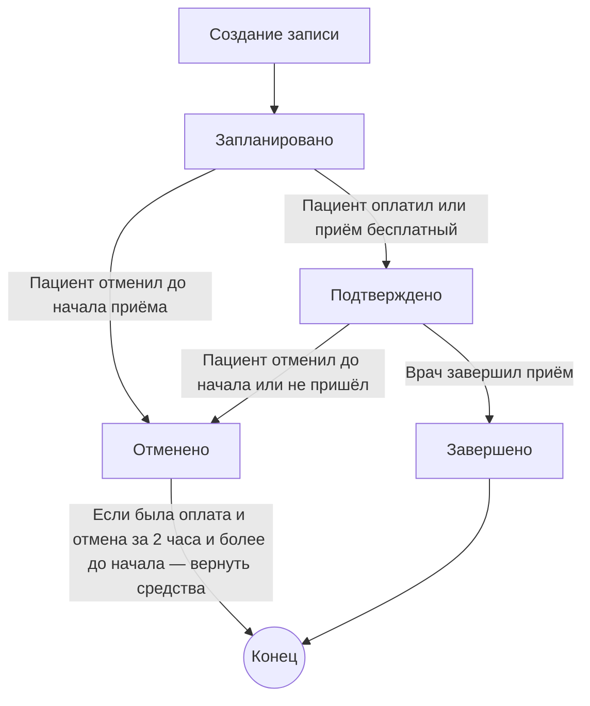

## Введение

### Кризис программного обеспечения

В начале 60-х годов перед американскими инженерами встала задача, которую до этого никто никогда не решал - отправить человека на Луну. Четкого представления как это сделать ни у кого не было, но они точно знали, как нужно мыслить, чтобы справиться с такой проблемой. Эта манера мыслить называется "системным мышлением", а реализуется оно с помощью системного подхода.
Системное мышление лежит в основе любой инженерной деятельности (будь это программная, строительная или аэрокосмическая инженерия) и является ее базовым фундаментом.

Суть системного подхода - разбиение сложной задачи на более мелкие, управляемые части, и повторение этого процесса рекурсивно, пока каждая часть не станет понятной и решаемой. Главная цель системного мышления - борьба со сложностью.

С ростом вычислительных мощностей в 60-х годах перед компьютерными инженерами эта проблема встала особенно остро, и она получила название **"кризис программного обеспечения"**: программы становились все более сложными, трудно поддерживаемыми и хрупкими. Проблема была настолько существенной, что ее обсуждали на международной конференции НАТО в 1968 году, где  впервые и был введен термин **"программная инженерия"**, призванный стимулировать поиск решений для выхода из кризиса и формализовать подходы к созданию более качественного, надежного и поддерживаемого программного обеспечения. С тех пор программная инженерия выросла в полноценную дисциплину и профессию, изучающую методы проектирования, разработки и сопровождения сложных систем.

### Эволюция подходов к разработке ПО

#### Процедурный подход

С середины 20-го века и до конца 70-х годов в разработке программ доминировал процедурный подход. Он опирался на принципы процедурного программирования, часто с конструкциями GOTO, где данные и функции их обработки формально не были связаны. Теоретической моделью процедурного программирования служит абстрактная вычислительная система - машина Тьюринга, а сам подход отражает архитектуру традиционных ЭВМ (архитектуру фон Неймана).

С ростом сложности решаемых задач, такой подход и породил тот самый *кризис программного обеспечения* - код разрастался, становился трудно читаемым, запутанным и хрупким: любое изменение могло сломать систему, и держать в голове общую картину становилось практически невозможно. Старые методы оказались недостаточными для поддержки и развития сложных приложений.

#### ООП

Ответом на этот кризис стало развитие **объектно-ориентированного подхода**. Уже в 1967 году в языке Simula были предложены такие революционные идеи, как объекты, классы и виртуальные методы. Практическое воплощение этих идей пришло с появлением Smalltalk в начале 80-х годов - первого широко распространенного объектно-ориентированного языка. OOП позволил объединять данные и поведение в единые смысловые объекты, структурировать систему вокруг сущностей предметной области, а не только вокруг процедур и функций. Наследование, инкапсуляция и полиморфизм стали основными инструментами управления сложностью, позволяя создавать более устойчивый, понятный и расширяемый код.

Однако жизнь не стоит на месте, и с ростом вычислительных мощностей, появлением интернета и все более глубоким проникновением цифровых технологий в повседневную жизнь, сложность решаемых этими технологиями задач выросла многократно.

Объектно-ориентированный подход дал разработчикам выразительные средства моделирования и организации кода, но реальная индустрия двинулась в сторону удобства и скорости. Вместе с бурным развитием веб-фреймворков, ORM и REST-сервисов, на первый план вышел **CRUD-подход** (от Create, Read, Update, Delete).

#### CRUD

CRUD предлагал простую и понятную схему - четыре базовые операции для работы с данными. Каждый контроллер или экран приложения оборачивал одну таблицу базы данных, предоставляя методы для создания, чтения, обновления и удаления записей. Этот подход оказался чрезвычайно удобен: позволял быстро строить админки, REST-интерфейсы и прототипы, не вдаваясь в тонкости предметной области.

Но у скорости всегда есть оборотная сторона - цена сложности. Когда приложения становились богаче на сценарии и бизнес-правила, CRUD переставал справляться. Логика начинала расползаться по слоям и дублироваться: что-то проверялось в контроллере, что-то в сервисе, что-то в базе, что-то - прямо на фронте. Каждое изменение бизнес-правила превращалось в охоту за призраками: одно и то же условие нужно было менять в нескольких местах, и если что-то упустить, то могла пострадать целостность (data integrity) и непротиворечивость (consistency) данных.

CRUD отлично служит там, где данные - это просто данные. Но когда предметная область становится более сложной, со своими законами, ограничениями и поведением, CRUD начинает трещать по швам.

#### DDD

И именно в этот момент на сцену вышел новый подход, который поставил в центр внимания не просто хранение данных, а **правила и поведение в предметной области**. В 2003 году увидела свет знаменитая "синяя книга" Эрика Эванса - ***"Предметно-ориентированное проектирование (DDD): структуризация сложных программных систем"***. Она не предложила новый язык или фреймворк, но представила **системный и целостный подход к проектированию приложений через модель реального мира**, возвращая разработчиков к инженерному мышлению, сосредоточенному на смысле и поведении системы, а не только на структуре данных.  DDD стало не просто архитектурным шаблоном, а образом мышления. Оно позволило вновь соединить то, что разделилось в CRUD-подходе: данные и смысл.  
Классы и методы сущностей в DDD отражают реальные объекты в предметной области, их свойства, поведение и взаимодействия, тем самым моделируя внешний мир. А не служат лишь структурами для хранения и извлечения данных из базы (т.н. "анемичная модель"), как это обычно происходит при CRUD-подходе , когда поведение и правила предметной области "разбросаны" по разным методам сервисов и контроллеров.

В нулевые годы индустрия и сообщество разработчиков созревали для применения DDD. После облачной революции и развитием распределенных приложений появилась возможность строить более сложные и гибкие системы, где принципы DDD особенно хорошо проявляли свою ценность. К середине 2010-х DDD стал активно применяться в профессиональных командах, особенно при проектировании микросервисов и масштабируемых высоконагруженных корпоративных решений.

Сразу отмечу, что не стоит воспринимать DDD как противоположность ООП. Как в свою очередь ООП вырос из штанишек процедурного программирования, так и предметно-ориентированное проектирование является результатом развития и применения основных принципов и методов ООП.

Фундаментом для DDD является ООП. А фундаментом ООП в свою очередь выступает процедурное программирование.

Cтоит понимать, что DDD не противопоставляется и CRUD. Это не конкурирующие подходы, а инструменты для решения разных типов задач. CRUD-подход фокусируется на простоте и технической стороне работы с данными - создать, прочитать, обновить, удалить. Это удобно для простых систем, где бизнес-логика минимальна.

DDD же применяется там, где предметная область сложна, насыщена взаимосвязанными правилами и требования постоянно меняются под давлением бизнеса. DDD не отменяет CRUD, а поднимается над ним, добавляя такие понятия как контекст, язык и определяет структуру для построения устойчивой и изменчивой системы, которая может гибко эволюционировать вместе с бизнесом.

## Структура DDD

DDD разделяется на две части.

1. **Стратегические паттерны** помогают понять предметную область в целом, разделить ее на изолированные контексты и определить их взаимосвязи. Они позволяют выявить специфические термины и составить их глоссарий, спланировать команды разработки и их взаимодействие, а также приоритеты задач. Проще говоря - стратегические паттерны помогают смоделировать предметную область и спланировать ее реализацию. Этап системного анализа и планирования.

К стратегическим паттернам относятся такие понятия как:

- Предметная область (Domain)
- Ограниченный контекст (Bounded context).
- Единный язык (Ubiquitous Language)
- Предметные подобласти (Subdomain)
- Смысловое ядро (Core domain)
- Служебные подобласти (Supporting subdomain)
- Неспециализированные подобласти (Generic subdomain).
- Карта контекстов (Context map)
- Штурм событий (Event storming)

2. **Тактические паттерны** помогают реализовать модель на практике, в виде кода. Этап реализации. Они описывают сущности, их поведение и взаимодействия внутри контекста. К ним относятся:

- Сущность (Entity)
- Объект-Значение (Value Object)
- Агрегат (Aggregate)
- Служба Предметной Области (Domain Service)
- Событие (Domain Event)
- Модуль (Module)
- Фабрика (Factory)
- Хранилищe (Repository)

С помощью DDD удобно проектировать как распределенные микросервисные системы, так и модульные монолиты с четко изолированными частями, благодаря ясной декомпозиции предметной области на ограниченные контексты (Bounded Context), разграничению ответственности агрегатов и согласованному использованию единого языка (Ubiquitous Language). Такой подход позволяет моделировать сложное поведение внутри каждого контекста, минимизируя нежелательные зависимости между частями системы и облегчая эволюцию приложения без разрушения его целостности.

В данной статье мы не будем подробно разбирать все эти паттерны, особенно стратегические, а сосредоточимся на практической стороне.  Сначала реализуем небольшой бизнес-процесс сначала с помощью CRUD подхода, а затем посредством DDD.  И уже в ходе непосредственной DDD реализации разберем некоторые ключевые моменты основных тактических паттернов.

Чтобы не перегружать повествование излишними деталями,  возьмем небольшую и довольно простую мини-модель предметной области - процесс онлайн-записи к врачу. Она простая на поверхности, но с кучей скрытых бизнес-правил.
C ее помощью можно показать почти все, что делает DDD полезным: слоты расписания, ограничения по времени, отмена записей на прием, смена статуса, проверка пересечений, оплата и напоминания.

## Постановка задачи

Необходимо разработать систему онлайн-записи к врачу, которая позволяет пациентам выбирать доступное время приёма, оплачивать визит и при необходимости отменять его.  
Система должна учитывать расписание врачей, контролировать доступность слотов и корректность оплат в рамках одного часового пояса. 

### Основные участники

- **Врач** — создаёт расписание приёмов, определяя даты, время и стоимость.
- **Пациент** — выбирает врача и записывается на свободное время.
- **Пользователь** — может совмещать роли врача и пациента, но не в рамках одного приёма.
    
### Функциональные сценарии

1. **Создание расписания врача**  
    Врач задаёт время и стоимость приёмов. Система не допускает пересечений по времени и создание расписания на прошедшие даты.
2. **Запись пациента на приём**  
	Пациент может создать запись на свободный слот в статусе _запланировано_. Другой пациент может записаться на этот же слот только если пока нет оплаты от другого пациента.
3. **Подтверждение приёма**  
    Запись становится _подтверждённой_ после полной оплаты или если приём бесплатный.
4. **Отмена приёма**  
    Пациент может отменить запись в любое время до начала приёма.  При отмене за 2 часа и более оплаченные средства возвращаются.
5. **Завершение приёма**  
    После окончания визита врач переводит запись в статус _завершено_ или _отменено_, если пациент не пришёл. 
    Завершённые и отменённые приёмы изменению не подлежат.
6. **Учёт оплат**
    Система фиксирует все платежи по приёму. Один приём может иметь несколько оплат, но их общая сумма не может превышать стоимость слота. После отмены или завершения визита новые оплаты запрещены.

Диаграмма переходов статусов записи на приём


## CRUD решение

В CRUD подходе вся логика реализации строится вокруг структуры хранения. Поэтому в первую очередь определяем сущности, которые мы будем сохранять в БД.  Иными словами проектируем структуру таблиц БД, на базе объектно-ориентированного похода, стараясь следовать первым 3-4 правилам нормализации данных, в некоторых моментах сознательно пренебрегая ими, ради увеличения производительности и упрощения запросов.

### Модель хранения данных

Исходя из этих соображений и проектируется "доменный слой" CRUD приложения. Доменный слой я специально взял в кавычки. Бывает что  создается проект или папка с именем "Domain", где хранятся сущности определяющие структуру таблиц с помощью EntityFramework, и встречал не раз такое, что на этом основании некоторые разработчики считают что у них в проекте используется подход DDD, что конечно же далеко от истины.

```mermaid
erDiagram
  USER ||--o{ DOCTOR : "has (cascade delete)"
  USER ||--o{ PATIENT : "has (cascade delete)"

  DOCTOR ||--o{ SCHEDULE : "has (cascade delete)"
  DOCTOR ||--o{ APPOINTMENT : "has"
  PATIENT ||--o{ APPOINTMENT : "books"
  SCHEDULE ||--o{ APPOINTMENT : "provides_slot_for"
  APPOINTMENT ||--o{ PAYMENT : "may_have"

  USER {
    int Id
    string Name
    string Email
    string Phone
  }

  DOCTOR {
    int Id
    int UserId
    string Specialization
  }

  PATIENT {
    int Id
    int UserId
    date DateOfBirth
  }

  SCHEDULE {
    int Id
    int DoctorId
    date Date
    time StartTime
    time EndTime
    bool IsBusy
    decimal Price
    %% Unique index: DoctorId + Date + StartTime
  }

  APPOINTMENT {
    int Id
    int DoctorId
    int PatientId
    int ScheduleId
    datetime ScheduledTime
    string Status  %% AppointmentStatus (Scheduled, Confirmed, Cancelled, Completed)
  }

  PAYMENT {
    int Id
    int AppointmentId
    decimal Amount
    string Status  %% PaymentStatus (Paid, Refunded)
    datetime PaymentDate
  }


```

Для наглядности я представил ER диаграмму таблиц БД, которая по своей структуре и связям соответствуют классам "доменной" модели CRUD решения.

Ниже можно посмотреть сами классы EF моделей и DbContext:

> [!example]- Enums
> ```cs
> public enum AppointmentStatus
> {
>     Scheduled,
>     Confirmed,
>     Cancelled,
>     Completed
> }
> 
> public enum PaymentStatus
> {
>     Paid,
>     Refunded
> }
> ```

>[!example]- Models 
>```cs
> public class User
> {
>     public int Id { get; set; }
>     public string Name { get; set; } = null!;
>     public string Email { get; set; } = null!;
>     public string Phone { get; set; } = null!;
> 
>     public ICollection<Doctor>? Doctors { get; set; }
>     public ICollection<Patient>? Patients { get; set; }
> }
> 
> public class Doctor
> {
>     public int Id { get; set; }
>     public int UserId { get; set; }
>     public string Specialization { get; set; } = null!;
> 
>     [ValidateNever]
>     public User User { get; set; } = null!;
>     public ICollection<Schedule>? Schedules { get; set; }
>     public ICollection<Appointment>? Appointments { get; set; }
> }
> 
> public class Patient
> {
>     public int Id { get; set; }
>     public int UserId { get; set; }
>     public DateOnly DateOfBirth { get; set; }
> 
>     [ValidateNever]
>     public User User { get; set; } = null!;
>     public ICollection<Appointment>? Appointments { get; set; }
> }
> 
> public class Schedule
> {
>     public int Id { get; set; }
>     public int DoctorId { get; set; }
>     public DateOnly Date { get; set; }
>     public TimeOnly StartTime { get; set; }
>     public TimeOnly EndTime { get; set; }
> 
>     public bool IsBusy { get; set; }
> 
>     public decimal Price { get; set; }
> 
>     [ValidateNever]
>     public Doctor Doctor { get; set; } = null!;
>     public ICollection<Appointment>? Appointments { get; set; }
> }
> 
> public class Appointment
> {
>     public int Id { get; set; }
>     public int DoctorId { get; set; }
>     public int PatientId { get; set; }
>     public int ScheduleId { get; set; }
>     public DateTime ScheduledTime { get; set; }
>     public AppointmentStatus Status { get; set; }
> 
>     [ValidateNever]
>     public Doctor Doctor { get; set; } = null!;
>     [ValidateNever]
>     public Patient Patient { get; set; } = null!;
>     [ValidateNever]
>     public Schedule Schedule { get; set; } = null!;
>     public ICollection<Payment>? Payments { get; set; }
> }
> 
> public class Payment
> {
>     public int Id { get; set; }
>     public int AppointmentId { get; set; }
>     public decimal Amount { get; set; }
>     public PaymentStatus Status { get; set; }
>     public DateTime PaymentDate { get; set; }
> 
>     [ValidateNever]
>     public Appointment Appointment { get; set; } = null!;
> }
> 
> ```

> [!example]- DbContext 
> ```cs
> public class MedicalBookingContext : DbContext
> {
>     public MedicalBookingContext(DbContextOptions<MedicalBookingContext> options)
>         : base(options)
>     {
>     }
> 
>     public DbSet<User> Users { get; set; } = null!;
>     public DbSet<Doctor> Doctors { get; set; } = null!;
>     public DbSet<Patient> Patients { get; set; } = null!;
>     public DbSet<Schedule> Schedules { get; set; } = null!;
>     public DbSet<Appointment> Appointments { get; set; } = null!;
>     public DbSet<Payment> Payments { get; set; } = null!;
> 
>     protected override void OnModelCreating(ModelBuilder modelBuilder)
>     {
>         // User
>         modelBuilder.Entity<User>()
>             .HasMany(u => u.Doctors)
>             .WithOne(d => d.User)
>             .HasForeignKey(d => d.UserId)
>             .OnDelete(DeleteBehavior.Cascade);
> 
>         modelBuilder.Entity<User>()
>             .HasMany(u => u.Patients)
>             .WithOne(p => p.User)
>             .HasForeignKey(p => p.UserId)
>             .OnDelete(DeleteBehavior.Cascade);
> 
>         // Doctor
>         modelBuilder.Entity<Doctor>()
>             .HasMany(d => d.Schedules)
>             .WithOne(s => s.Doctor)
>             .HasForeignKey(s => s.DoctorId)
>             .OnDelete(DeleteBehavior.Cascade);
> 
>         modelBuilder.Entity<Doctor>()
>             .HasMany(d => d.Appointments)
>             .WithOne(a => a.Doctor)
>             .HasForeignKey(a => a.DoctorId);
> 
>         // Schedule
>         modelBuilder.Entity<Schedule>()
>             .HasIndex(s => new { s.DoctorId, s.Date, s.StartTime })
>             .IsUnique();
> 
>         modelBuilder.Entity<Schedule>()
>             .HasMany(s => s.Appointments)
>             .WithOne(a => a.Schedule)
>             .HasForeignKey(a => a.ScheduleId);
> 
>         // Patient
>         modelBuilder.Entity<Patient>()
>             .HasMany(p => p.Appointments)
>             .WithOne(a => a.Patient)
>             .HasForeignKey(a => a.PatientId);
> 
>         // Appointment
>         modelBuilder.Entity<Appointment>()
>             .HasMany(a => a.Payments)
>             .WithOne(p => p.Appointment)
>             .HasForeignKey(p => p.AppointmentId);
> 
>         modelBuilder.Entity<Appointment>()
>             .Property(a => a.Status)
>             .HasConversion<int>();
> 
>         modelBuilder.Entity<Payment>()
>             .Property(p => p.Status)
>             .HasConversion<int>();
>     }
> }
> ```

Как часто бывает в реальных CRUD-проектах, добавим паттерны **Repository** и **UnitOfWork**. Лично я не сторонник их использования поверх DbContext, поскольку он уже реализует оба паттерна, и дополнительный слой абстракций без явной необходимости обычно избыточен. Однако для большей реалистичности примера мы их всё же применим.

> [!example]- Repository 
> ```cs
> public interface IRepository<T> where T : class
> {
>     Task<List<T>> GetAllAsync(Func<IQueryable<T>, IQueryable<T>>? include = null, bool asNoTracking = true);
>     Task<T?> GetByIdAsync(int id, Func<IQueryable<T>, IQueryable<T>>? include = null);
>     Task AddAsync(T entity);
>     void Update(T entity);
>     void Remove(T entity);
>     Task<bool> AnyAsync(Expression<Func<T, bool>> predicate);
> }
>
> public class Repository<T> : IRepository<T> where T : class
> {
>     protected readonly MedicalBookingContext _context;
>     protected readonly DbSet<T> _dbSet;
> 
>     public Repository(MedicalBookingContext context)
>     {
>         _context = context;
>         _dbSet = context.Set<T>();
>     }
> 
>     public async Task<List<T>> GetAllAsync(Func<IQueryable<T>, IQueryable<T>>? include = null, bool asNoTracking = true)
>     {
>         IQueryable<T> query = _dbSet;
>         if (include != null) query = include(query);
>         if (asNoTracking) query = query.AsNoTracking();
>         return await query.ToListAsync();
>     }
> 
>     public async Task<T?> GetByIdAsync(int id, Func<IQueryable<T>, IQueryable<T>>? include = null)
>     {
>         IQueryable<T> query = _dbSet;
>         if (include != null) query = include(query);
>         return await query.FirstOrDefaultAsync(e => EF.Property<int>(e, "Id") == id);
>     }
> 
>     public async Task AddAsync(T entity)
>     {
>         await _dbSet.AddAsync(entity);
>     }
> 
>     public void Update(T entity)
>     {
>         _dbSet.Update(entity);
>     }
> 
>     public void Remove(T entity)
>     {
>         _dbSet.Remove(entity);
>     }
> 
>     public async Task<bool> AnyAsync(Expression<Func<T, bool>> predicate)
>     {
>         return await _dbSet.AnyAsync(predicate);
>     }
> }
> ```

> [!example]- UnitOfWork 
> ```cs
> public interface IUnitOfWork : IDisposable
> {
>     IRepository<User> Users { get; }
>     IRepository<Doctor> Doctors { get; }
>     IRepository<Patient> Patients { get; }
>     IRepository<Schedule> Schedules { get; }
>     IRepository<Appointment> Appointments { get; }
>     IRepository<Payment> Payments { get; }
> 
>     Task<int> SaveChangesAsync();
> 
>     // Execute arbitrary async action inside a DB transaction
>     Task ExecuteInTransactionAsync(Func<Task> action);
> }
>
> public class UnitOfWork : IUnitOfWork
> {
>     private readonly MedicalBookingContext _context;
> 
>     public IRepository<User> Users { get; }
>     public IRepository<Doctor> Doctors { get; }
>     public IRepository<Patient> Patients { get; }
>     public IRepository<Schedule> Schedules { get; }
>     public IRepository<Appointment> Appointments { get; }
>     public IRepository<Payment> Payments { get; }
> 
>     public UnitOfWork(MedicalBookingContext context)
>     {
>         _context = context;
>         Users = new Repository<User>(context);
>         Doctors = new Repository<Doctor>(context);
>         Patients = new Repository<Patient>(context);
>         Schedules = new Repository<Schedule>(context);
>         Appointments = new Repository<Appointment>(context);
>         Payments = new Repository<Payment>(context);
>     }
> 
>     public async Task<int> SaveChangesAsync()
>     {
>         return await _context.SaveChangesAsync();
>     }
> 
>     public async Task ExecuteInTransactionAsync(Func<Task> action)
>     {
>         // InMemory provider doesn't support transactions. Keep the transactional code visible (commented)
>         // so it can be restored for real DB providers, but run the action without transactions to avoid errors.
> 
>         // await using var tx = await _context.Database.BeginTransactionAsync();
>         try
>         {
>             await action();
>         //    await tx.CommitAsync();
>         }
>         catch
>         {
>         //    await tx.RollbackAsync();
>             throw;
>         }
>     }
> 
>     public void Dispose()
>     {
>         _context.Dispose();
>     }
> }
> ```

### Бизнес правила

Модель предметной области специально упрощена для учебных целей, но даже в таком виде она задаёт немало бизнес-ограничений, которые нужно проверять в коде. В реальных проектах подобных правил как правило значительно больше.

В CRUD-архитектуре сервисы - это слой, который инкапсулирует бизнес-логику, поэтому именно там, перед сохранением, выполняются проверки, чтобы гарантировать целостность данных и соблюдение правил предметной области.

#### User

- `User.Email` уникален в системе.

> [!example]- UserService 
> ```cs
> public class UserService : IUserService
> {
>     private readonly IUnitOfWork _uow;
> 
>     public UserService(IUnitOfWork uow)
>     {
>         _uow = uow;
>     }
> 
>     public async Task<List<User>> GetAllAsync()
>         => await _uow.Users.GetAllAsync();
> 
>     public async Task<User?> GetByIdAsync(int id)
>         => await _uow.Users.GetByIdAsync(id);
> 
>     public async Task CreateAsync(User user)
>     {
>         await EnsureEmailUniqueAsync(user);
>         await _uow.Users.AddAsync(user);
>         await _uow.SaveChangesAsync();
>     }
> 
>     public async Task UpdateAsync(User user)
>     {
>         await EnsureEmailUniqueAsync(user);
>         _uow.Users.Update(user);
>         await _uow.SaveChangesAsync();
>     }
> 
>     public async Task DeleteAsync(int id)
>     {
>         var entity = await _uow.Users.GetByIdAsync(id);
>         if (entity != null)
>         {
>             _uow.Users.Remove(entity);
>             await _uow.SaveChangesAsync();
>         }
>     }
> 
>     // --- Private helpers ---
> 
>     private async Task EnsureEmailUniqueAsync(User user)
>     {
>         var normalized = (user.Email ?? string.Empty).Trim().ToLowerInvariant();
>         var exists = await _uow.Users.AnyAsync(u =>
>             ((u.Email ?? string.Empty).ToLower()) == normalized &&
>             u.Id != user.Id);
> 
>         if (exists)
>             throw new InvalidOperationException("User.Email must be unique in the system.");
>     }
> }
> ```


#### Doctor / Patient

- `Doctor.UserId` и `Patient.UserId` должны ссылаться на существующий `User.Id`.   
- Один и тот же `User` может быть  как  `Doctor` так и `Patient`.
- Один `User` не может быть связан с двумя разными `Doctor` или с двумя разными `Patient`.

> [!example]- DoctorService 
> ```cs
> public class DoctorService : IDoctorService
> {
>     private readonly IUnitOfWork _uow;
> 
>     public DoctorService(IUnitOfWork uow)
>     {
>         _uow = uow;
>     }
> 
>     public async Task<List<Doctor>> GetAllAsync()
>     {
>         return await _uow.Doctors.GetAllAsync(q => q.Include(d => d.User));
>     }
> 
>     public async Task<Doctor?> GetByIdAsync(int id)
>     {
>         return await _uow.Doctors.GetByIdAsync(id, q => q.Include(d => d.User));
>     }
> 
>     public async Task CreateAsync(Doctor d)
>     {
>         await EnsureUserExistsAsync(d.UserId, "Doctor.UserId must reference an existing User.");
>         await EnsureUserNotAlreadyLinkedAsync(d.UserId, null);
>         await _uow.Doctors.AddAsync(d);
>         await _uow.SaveChangesAsync();
>     }
> 
>     public async Task UpdateAsync(Doctor d)
>     {
>         await EnsureUserExistsAsync(d.UserId, "Doctor.UserId must reference an existing User.");
>         await EnsureUserNotAlreadyLinkedAsync(d.UserId, d.Id);
>         _uow.Doctors.Update(d);
>         await _uow.SaveChangesAsync();
>     }
> 
>     public async Task DeleteAsync(int id)
>     {
>         var e = await _uow.Doctors.GetByIdAsync(id);
>         if (e != null) { _uow.Doctors.Remove(e); await _uow.SaveChangesAsync(); }
>     }
> 
>     private async Task EnsureUserExistsAsync(int userId, string message)
>     {
>         var exists = await _uow.Users.AnyAsync(u => u.Id == userId);
>         if (!exists)
>             throw new ArgumentException(message);
>     }
> 
>     private async Task EnsureUserNotAlreadyLinkedAsync(int userId, int? excludeDoctorId)
>     {
>         var linked = await _uow.Doctors.AnyAsync(d =>
>             d.UserId == userId &&
>             (excludeDoctorId == null || d.Id != excludeDoctorId.Value)
>         );
> 
>         if (linked)
>             throw new InvalidOperationException("This User is already associated with another Doctor.");
>     }
> }
> ```

> [!example]- PatientService 
> ```cs
> public class PatientService : IPatientService
> {
>     private readonly IUnitOfWork _uow;
> 
>     public PatientService(IUnitOfWork uow) { _uow = uow; }
> 
>     public async Task<List<Patient>> GetAllAsync() => await _uow.Patients.GetAllAsync(q => q.Include(p => p.User));
>     public async Task<Patient?> GetByIdAsync(int id) => await _uow.Patients.GetByIdAsync(id, q => q.Include(p => p.User));
> 
>     public async Task CreateAsync(Patient p)
>     {
>         await EnsureUserExistsAsync(p.UserId, "Patient.UserId must reference an existing User.");
>         await EnsureUserNotAlreadyLinkedAsync(p.UserId, null);
>         await _uow.Patients.AddAsync(p);
>         await _uow.SaveChangesAsync();
>     }
> 
>     public async Task UpdateAsync(Patient p)
>     {
>         await EnsureUserExistsAsync(p.UserId, "Patient.UserId must reference an existing User.");
>         await EnsureUserNotAlreadyLinkedAsync(p.UserId, p.Id);
>         _uow.Patients.Update(p);
>         await _uow.SaveChangesAsync();
>     }
> 
>     public async Task DeleteAsync(int id) { var e = await _uow.Patients.GetByIdAsync(id); if (e != null) { _uow.Patients.Remove(e); await _uow.SaveChangesAsync(); } }
> 
>     private async Task EnsureUserExistsAsync(int userId, string message)
>     {
>         var exists = await _uow.Users.AnyAsync(u => u.Id == userId);
>         if (!exists)
>             throw new ArgumentException(message);
>     }
> 
>     private async Task EnsureUserNotAlreadyLinkedAsync(int userId, int? excludePatientId)
>     {
>         var linked = await _uow.Patients.AnyAsync(p =>
>             p.UserId == userId &&
>             (excludePatientId == null || p.Id != excludePatientId.Value)
>         );
> 
>         if (linked)
>             throw new InvalidOperationException("This User is already associated with another Patient.");
>     }
> }
> ```

#### Schedule

- `Schedule.StartTime < Schedule.EndTime`.
- `Schedule.Date` не может быть в прошлом
- Для одного `Doctor.Id` не допускаются пересечения по времени слотов  (`Date`, `StartTime`, `EndTime`).
- `Schedule.Price >= 0` (допускаются бесплатные приёмы).
- Нельзя изменять или удалять `Schedule`, если существует связанный `Appointment`  
    со статусом `AppointmentStatus.Confirmed` или `AppointmentStatus.Completed`.
- `Schedule.IsBusy = true`, если существует `Appointment` со статусом  
    `Confirmed`.
    
> [!example]- ScheduleService 
> ```cs
> public class ScheduleService : IScheduleService
> {
>     private readonly IUnitOfWork _uow;
> 
>     public ScheduleService(IUnitOfWork uow)
>     {
>         _uow = uow;
>     }
> 
>     public async Task<List<Schedule>> GetAllAsync()
>     {
>         return await _uow.Schedules.GetAllAsync(q => q.Include(s => s.Doctor).ThenInclude(d => d.User));
>     }
> 
>     public async Task<Schedule?> GetByIdAsync(int id)
>     {
>         return await _uow.Schedules.GetByIdAsync(id, q => q.Include(s => s.Doctor).ThenInclude(d => d.User));
>     }
> 
>     public async Task CreateAsync(Schedule s)
>     {
>         await ValidateAndPrepareScheduleAsync(s);
> 
>         await _uow.Schedules.AddAsync(s);
>         await _uow.SaveChangesAsync();
>     }
> 
>     public async Task UpdateAsync(Schedule s)
>     {
>         await EnsureNotLockedAsync(s.Id);
>         await ValidateAndPrepareScheduleAsync(s, s.Id);
> 
>         _uow.Schedules.Update(s);
>         await _uow.SaveChangesAsync();
>     }
> 
>     public async Task DeleteAsync(int id)
>     {
>         await EnsureNotLockedAsync(id);
> 
>         var schedule = await _uow.Schedules.GetByIdAsync(id);
>         if (schedule != null)
>         {
>             _uow.Schedules.Remove(schedule);
>             await _uow.SaveChangesAsync();
>         }
>     }
> 
>     // --- Private helpers ---
> 
>     private async Task ValidateAndPrepareScheduleAsync(Schedule s, int? excludeScheduleId = null)
>     {
>         ValidateScheduleTimes(s);
>         ValidateScheduleDateNotPast(s);
>         ValidateSchedulePrice(s);
> 
>         var overlaps = await _uow.Schedules.AnyAsync(x =>
>             x.DoctorId == s.DoctorId &&
>             x.Date == s.Date &&
>             (!excludeScheduleId.HasValue || x.Id != excludeScheduleId.Value) &&
>             !(s.EndTime <= x.StartTime || s.StartTime >= x.EndTime)
>         );
> 
>         if (overlaps)
>             throw new ArgumentException("Schedule time overlaps with an existing schedule for the same doctor on the same date.");
> 
>         s.IsBusy = await _uow.Appointments.AnyAsync(a =>
>             a.ScheduleId == s.Id &&
>             (a.Status == AppointmentStatus.Scheduled || a.Status == AppointmentStatus.Confirmed)
>         );
>     }
> 
>     private async Task EnsureNotLockedAsync(int scheduleId)
>     {
>         var hasLockedAppointments = await _uow.Appointments.AnyAsync(a =>
>             a.ScheduleId == scheduleId &&
>             (a.Status == AppointmentStatus.Confirmed || a.Status == AppointmentStatus.Completed)
>         );
> 
>         if (hasLockedAppointments)
>             throw new InvalidOperationException("Cannot modify or delete schedule because there is at least one related appointment with status Confirmed or Completed.");
>     }
> 
>     private static void ValidateScheduleTimes(Schedule s)
>     {
>         if (s.StartTime >= s.EndTime)
>             throw new ArgumentException("Schedule.StartTime must be earlier than Schedule.EndTime.");
>     }
> 
>     private static void ValidateScheduleDateNotPast(Schedule s)
>     {
>         var today = DateOnly.FromDateTime(DateTime.Now);
>         if (s.Date < today)
>             throw new ArgumentException("Schedule.Date cannot be in the past.");
>     }
> 
>     private static void ValidateSchedulePrice(Schedule s)
>     {
>         if (s.Price < 0m)
>             throw new ArgumentException("Schedule.Price must be greater than or equal to 0.");
>     }
> }
> ```

#### Appointment

- `Appointment.Status` при создании = `Scheduled`.
- Один `Patient` не может иметь более одной активной записи (`Scheduled` или `Confirmed`) на один и тот же слот (`Schedule.Id`).
- Другой пациент может создать запись на тот же слот в `Scheduled` только если нет Confirmed записи на этом слоте.
- `ScheduledTime` не в прошлом и в пределах `[Schedule.Date + StartTime, Schedule.Date + EndTime]`.
- `Appointment.DoctorId` = `Schedule.DoctorId`.
- `Appointment.Doctor.UserId` ≠ `Appointment.Patient.UserId`.
- Статус нельзя менять после `Completed` или `Cancelled`.
- `Completed` можно установить только из `Confirmed`.

> [!example]- AppointmentService 
> ```cs
> public class AppointmentService : IAppointmentService
> {
>     private readonly IUnitOfWork _uow;
>     private readonly IPaymentService _paymentService;
> 
>     public AppointmentService(IUnitOfWork uow, IPaymentService paymentService)
>     {
>         _uow = uow;
>         _paymentService = paymentService;
>     }
> 
>     public async Task<List<Appointment>> GetAllAsync()
>     {
>         return await _uow.Appointments.GetAllAsync(q => q
>             .Include(a => a.Doctor).ThenInclude(d => d.User)
>             .Include(a => a.Patient).ThenInclude(p => p.User)
>             .Include(a => a.Schedule)
>         );
>     }
> 
>     public async Task<Appointment?> GetByIdAsync(int id)
>     {
>         return await _uow.Appointments.GetByIdAsync(id, q => q
>             .Include(a => a.Doctor).ThenInclude(d => d.User)
>             .Include(a => a.Patient).ThenInclude(p => p.User)
>             .Include(a => a.Schedule)
>         );
>     }
> 
>     public async Task CreateAsync(Appointment a)
>     {
>         a.Status = AppointmentStatus.Scheduled;
> 
>         await ExecuteWithAppointmentAndScheduleAsync(a, async (appt, schedule) =>
>         {
>             await EnsurePatientHasNoOtherActiveAppointmentsAsync(appt);
> 
>             if (schedule.IsBusy)
>                 throw new InvalidOperationException("Cannot create appointment: schedule is busy.");
> 
>             RunValidations(appt, schedule, await LoadPatientWithUser(appt.PatientId));
> 
>             await _uow.Appointments.AddAsync(appt);
>             await _uow.SaveChangesAsync();
>         });
>     }
> 
>     public async Task UpdateAsync(Appointment a)
>     {
>         var existing = await LoadAppointmentWithRelations(a.Id);
> 
>         EnsureStatusChangeIsValid(existing, a);
> 
>         await ExecuteWithAppointmentAndScheduleAsync(a, async (appt, schedule) =>
>         {
>             await EnsurePatientHasNoOtherActiveAppointmentsAsync(appt, existing);
> 
>             RunValidations(appt, schedule, existing.Patient ?? await LoadPatientWithUser(appt.PatientId));
> 
>             if (appt.Status != existing.Status)
>             {
>                 await _uow.ExecuteInTransactionAsync(async () =>
>                 {
>                     _uow.Appointments.Update(appt);
>                     await _uow.SaveChangesAsync();
> 
>                     if (appt.Status == AppointmentStatus.Cancelled)
>                         await _paymentService.RefundPaidPaymentsForCancellationIfEligibleAsync(appt.Id);
> 
>                     await UpdateScheduleIsBusyAsync(appt.ScheduleId);
>                 });
>                 return;
>             }
> 
>             _uow.Appointments.Update(appt);
>             await _uow.SaveChangesAsync();
>         });
>     }
> 
>     public async Task DeleteAsync(int id)
>     {
>         var appt = await _uow.Appointments.GetByIdAsync(id);
>         if (appt == null) return;
> 
>         _uow.Appointments.Remove(appt);
>         await _uow.SaveChangesAsync();
> 
>         await UpdateScheduleIsBusyAsync(appt.ScheduleId);
>     }
> 
>     // --- Private helpers ---
>     private async Task ExecuteWithAppointmentAndScheduleAsync(Appointment a, Func<Appointment, Schedule, Task> action)
>     {
>         var schedule = await LoadScheduleWithDoctor(a.ScheduleId);
>         await action(a, schedule);
>     }
> 
>     private static void RunValidations(Appointment a, Schedule s, Patient p)
>     {
>         ValidateDoctorMatchesSchedule(a, s);
>         ValidateScheduledTimeWithinBounds(a, s);
>         ValidateDoctorAndPatientNotSameUser(s, p);
>     }
> 
>     private async Task EnsurePatientHasNoOtherActiveAppointmentsAsync(Appointment a, Appointment? existing = null)
>     {
>         var existingId = existing?.Id ?? 0;
> 
>         var hasOtherActive = await _uow.Appointments.AnyAsync(x =>
>             x.Id != existingId &&
>             x.PatientId == a.PatientId &&
>             x.ScheduleId == a.ScheduleId &&
>             (x.Status == AppointmentStatus.Scheduled || x.Status == AppointmentStatus.Confirmed)
>         );
> 
>         if (hasOtherActive)
>             throw new InvalidOperationException("Patient already has an active appointment (Scheduled or Confirmed) for this schedule.");
>     }
> 
>     private static void ValidateDoctorMatchesSchedule(Appointment a, Schedule s)
>     {
>         if (a.DoctorId != s.DoctorId)
>             throw new ArgumentException("Appointment.DoctorId must match Schedule.DoctorId.");
>     }
> 
>     private static void ValidateScheduledTimeWithinBounds(Appointment a, Schedule s)
>     {
>         if (a.ScheduledTime < DateTime.Now)
>             throw new ArgumentException("Appointment.ScheduledTime cannot be in the past.");
> 
>         var scheduleStart = s.Date.ToDateTime(s.StartTime);
>         var scheduleEnd = s.Date.ToDateTime(s.EndTime);
> 
>         if (a.ScheduledTime < scheduleStart || a.ScheduledTime > scheduleEnd)
>             throw new ArgumentException("Appointment.ScheduledTime must be within the schedule time interval.");
>     }
> 
>     private static void ValidateDoctorAndPatientNotSameUser(Schedule s, Patient p)
>     {
>         var doctorUserId = s.Doctor?.User?.Id;
>         var patientUserId = p.User?.Id;
>         if (doctorUserId != null && patientUserId != null && doctorUserId == patientUserId)
>             throw new ArgumentException("Doctor.UserId cannot be equal to Patient.UserId.");
>     }
> 
>     private static void EnsureStatusChangeIsValid(Appointment existing, Appointment updated)
>     {
>         if ((existing.Status == AppointmentStatus.Completed || existing.Status == AppointmentStatus.Cancelled) &&
>             updated.Status != existing.Status)
>             throw new InvalidOperationException("Cannot change status after appointment reached Completed or Cancelled.");
> 
>         if (updated.Status == AppointmentStatus.Completed && existing.Status != AppointmentStatus.Confirmed)
>             throw new InvalidOperationException("Appointment can be set to Completed only from Confirmed status.");
>     }
> 
>     private async Task<Appointment> LoadAppointmentWithRelations(int id)
>     {
>         return await _uow.Appointments.GetByIdAsync(id, q => q
>             .Include(x => x.Schedule).ThenInclude(s => s.Doctor).ThenInclude(d => d.User)
>             .Include(x => x.Patient).ThenInclude(p => p.User)
>         ) ?? throw new ArgumentException("Appointment not found.");
>     }
> 
>     private async Task<Schedule> LoadScheduleWithDoctor(int id)
>     {
>         return await _uow.Schedules.GetByIdAsync(id, q => q
>             .Include(s => s.Doctor).ThenInclude(d => d.User)
>         ) ?? throw new ArgumentException("Schedule not found.");
>     }
> 
>     private async Task<Patient> LoadPatientWithUser(int id)
>     {
>         return await _uow.Patients.GetByIdAsync(id, q => q.Include(p => p.User))
>             ?? throw new ArgumentException("Patient not found.");
>     }
> 
>     private async Task UpdateScheduleIsBusyAsync(int scheduleId)
>     {
>         var hasActive = await _uow.Appointments.AnyAsync(x =>
>             x.ScheduleId == scheduleId && x.Status == AppointmentStatus.Confirmed
>         );
> 
>         var sched = await _uow.Schedules.GetByIdAsync(scheduleId);
>         if (sched != null)
>         {
>             sched.IsBusy = hasActive;
>             _uow.Schedules.Update(sched);
>             await _uow.SaveChangesAsync();
>         }
>     }
> }
> 
> ```

#### Payment

- `Amount > 0`, `Status` оплат только `Paid` или `Refunded`. 
- Сумма всех `Paid` для одного `Appointment.Id` ≤ `Schedule.Price`.
- Платёж запрещён, если для этого `Schedule.Id` уже есть `Paid` от другого пациента.
- При полной оплате `Appointment.Status = Confirmed`, слот блокируется `Schedule.IsBusy = true`.
- При отмене за ≥2 часа до начала слота все `Paid` переводятся в `Refunded`.
- После `Cancelled` или `Completed` новые платежи запрещены для этого `Appointment.Id`.
- `Payment.AppointmentId` должен ссылаться на существующий `Appointment.Id`.

> [!example]- PaymentService 
> ```cs
> public class PaymentService : IPaymentService
> {
>     private readonly IUnitOfWork _uow;
> 
>     public PaymentService(IUnitOfWork uow)
>     {
>         _uow = uow;
>     }
> 
>     public async Task<List<Payment>> GetAllAsync()
>     {
>         return await _uow.Payments.GetAllAsync(q => q
>             .Include(p => p.Appointment).ThenInclude(a => a.Doctor).ThenInclude(d => d.User)
>             .Include(p => p.Appointment).ThenInclude(a => a.Schedule)
>         );
>     }
> 
>     public async Task<Payment?> GetByIdAsync(int id)
>     {
>         return await _uow.Payments.GetByIdAsync(id, q => q
>             .Include(p => p.Appointment).ThenInclude(a => a.Doctor).ThenInclude(d => d.User)
>             .Include(p => p.Appointment).ThenInclude(a => a.Schedule)
>         );
>     }
> 
>     public async Task<decimal> CreateAsync(Payment p)
>     {
>         var (appointment, paidPayments) = await PreparePaymentForValidationAsync(p);
>         await EnsurePaymentAllowedAsync(p, appointment, paidPayments);
> 
>         await _uow.Payments.AddAsync(p);
>         await _uow.SaveChangesAsync();
> 
>         return ComputeNewPaidSum(paidPayments, p);
>     }
> 
>     public async Task<decimal> UpdateAsync(Payment p)
>     {
>         var existing = await LoadPaymentAsync(p.Id);
>         var (appointment, paidPayments) = await PreparePaymentForValidationAsync(existing);
> 
>         await EnsurePaymentAllowedAsync(p, appointment, paidPayments, existing);
> 
>         _uow.Payments.Update(p);
>         await _uow.SaveChangesAsync();
> 
>         return ComputeNewPaidSum(paidPayments, p, existing);
>     }
> 
>     public async Task<decimal> DeleteAsync(int id)
>     {
>         var existing = await LoadPaymentAsync(id);
>         var appointment = await LoadAppointmentAsync(existing.AppointmentId);
>         var paidPayments = await GetPaidPaymentsForAppointmentAsync(existing.AppointmentId);
> 
>         _uow.Payments.Remove(existing);
>         await _uow.SaveChangesAsync();
> 
>         return paidPayments.Where(x => x.Id != existing.Id).Sum(x => x.Amount);
>     }
> 
>     public async Task RefundPaidPaymentsForCancellationIfEligibleAsync(int appointmentId)
>     {
>         var appointment = await LoadAppointmentAsync(appointmentId);
>         if (appointment.Status != AppointmentStatus.Cancelled) return;
> 
>         var slotStart = appointment.Schedule?.Date.ToDateTime(appointment.Schedule.StartTime)
>                         ?? throw new ArgumentException("Appointment.Schedule must be loaded.");
> 
>         if ((slotStart - DateTime.Now) < TimeSpan.FromHours(2)) return;
> 
>         var paidPayments = await GetPaidPaymentsForAppointmentAsync(appointmentId);
>         foreach (var pay in paidPayments)
>             pay.Status = PaymentStatus.Refunded;
> 
>         if (paidPayments.Count > 0)
>         {
>             foreach (var pay in paidPayments)
>                 _uow.Payments.Update(pay);
> 
>             await _uow.SaveChangesAsync();
>         }
>     }
> 
>     // --- Private helpers ---
> 
>     private async Task<(Appointment appointment, List<Payment> paidPayments)> PreparePaymentForValidationAsync(Payment p)
>     {
>         var appointment = await LoadAppointmentAsync(p.AppointmentId);
> 
>         ValidatePaymentAmount(p);
>         ValidatePaymentStatus(p);
> 
>         var paidPayments = await GetPaidPaymentsForAppointmentAsync(p.AppointmentId);
> 
>         if (appointment.Status == AppointmentStatus.Cancelled || appointment.Status == AppointmentStatus.Completed)
>             throw new InvalidOperationException("Cannot create or update payments for appointments that are Cancelled or Completed.");
> 
>         return (appointment, paidPayments);
>     }
> 
>     private async Task EnsurePaymentAllowedAsync(Payment newPayment, Appointment appointment, List<Payment> paidPayments, Payment? existing = null)
>     {
>         if (newPayment.Status == PaymentStatus.Paid)
>         {
>             var otherPatientPaidExists = await _uow.Appointments.AnyAsync(a =>
>                 a.ScheduleId == appointment.ScheduleId &&
>                 a.PatientId != appointment.PatientId &&
>                 a.Payments != null &&
>                 a.Payments.Any(pay =>
>                     pay.Status == PaymentStatus.Paid &&
>                     (existing == null || pay.Id != existing.Id))
>             );
> 
>             if (otherPatientPaidExists)
>                 throw new InvalidOperationException("Cannot accept payment: another patient already paid for this schedule.");
>         }
> 
>         var paidExcludingThis = existing != null
>             ? paidPayments.Where(x => x.Id != existing.Id).Sum(x => x.Amount)
>             : paidPayments.Sum(x => x.Amount);
> 
>         var newPaidSum = paidExcludingThis + (newPayment.Status == PaymentStatus.Paid ? newPayment.Amount : 0m);
> 
>         if (newPaidSum > appointment.Schedule.Price)
>             throw new InvalidOperationException("Total paid payments for this appointment would exceed the schedule price.");
>     }
> 
>     private decimal ComputeNewPaidSum(IEnumerable<Payment> paidPayments, Payment newPayment, Payment? existing = null)
>     {
>         var sum = paidPayments
>             .Where(x => existing == null || x.Id != existing.Id)
>             .Sum(x => x.Amount);
> 
>         return sum + (newPayment.Status == PaymentStatus.Paid ? newPayment.Amount : 0m);
>     }
> 
>     private Task<List<Payment>> GetPaidPaymentsForAppointmentAsync(int appointmentId)
>     {
>         return _uow.Payments.GetAllAsync(q => q.Where(x => x.AppointmentId == appointmentId && x.Status == PaymentStatus.Paid));
>     }
> 
>     private async Task<Payment> LoadPaymentAsync(int paymentId)
>     {
>         return await _uow.Payments.GetByIdAsync(paymentId)
>             ?? throw new ArgumentException("Payment not found.");
>     }
> 
>     private async Task<Appointment> LoadAppointmentAsync(int appointmentId)
>     {
>         return await _uow.Appointments.GetByIdAsync(appointmentId, q => q
>             .Include(a => a.Schedule)
>             .Include(a => a.Patient)
>             .Include(a => a.Payments)
>         ) ?? throw new ArgumentException("Appointment not found.");
>     }
> 
>     private static void ValidatePaymentAmount(Payment p)
>     {
>         if (p.Amount <= 0m)
>             throw new ArgumentException("Payment.Amount must be greater than 0.");
>     }
> 
>     private static void ValidatePaymentStatus(Payment p)
>     {
>         if (p.Status != PaymentStatus.Paid && p.Status != PaymentStatus.Refunded)
>             throw new ArgumentException("Payment.Status must be either Paid or Refunded.");
>     }
> }
> 
> ```

При выполнении платежа требуется изменить статус записи на прием и обновить флаг занятости слота врача. В реальных проектах часто можно встретить, что это делается напрямую в базе данных, в сервисе PaymentService, что нарушает принцип единой ответственности. Правильнее разделить логику: смену статуса записи — в `AppointmentService`, смену занятости слота — в `ScheduleService`.

Однако возникает циклическая зависимость: `AppointmentService` должен обращаться к `PaymentService` при возврате оплаты, а `PaymentService` — к `AppointmentService` при подтверждении оплаты. Эту проблему решает `PaymentOrchestrationService`.

##### PaymentOrchestrationService

- Координирует операции с платежами, изменением статуса записи и управлением занятостью слота в рамках одной транзакции (`IUnitOfWork.ExecuteInTransactionAsync`).
- Устраняет циклическую зависимость между `PaymentService` и `AppointmentService`.
- Централизует бизнес-правила:
    - Перевод записи между `Scheduled` и `Confirmed`.
    - Управление занятостью слота (`IsBusy = true/false`).
    - Контроль конкурирующих платежей: новый платеж не принимается, если слот уже оплачен другим пациентом.
- Используется при создании, обновлении и удалении платежей:
    - Пересчет общей суммы оплат для записи.
    - Автоматическое подтверждение записи при полной оплате.
    - Обновление `Schedule.IsBusy` в соответствии с активными записями.
    - Блокировка возможности оплаты другими пользователями, если слот уже занят.
- Все операции выполняются в одной транзакции `UnitOfWork`, гарантируя согласованность данных между платежами, записью и занятостью слота.

> [!example]- PaymentOrchestrationService 
> ```cs
> public class PaymentOrchestrationService : IPaymentOrchestrationService
> {
>     private readonly IUnitOfWork _uow;
>     private readonly IPaymentService _paymentService;
> 
>     public PaymentOrchestrationService(IUnitOfWork uow, IPaymentService paymentService)
>     {
>         _uow = uow;
>         _paymentService = paymentService;
>     }
> 
>     public async Task CreatePaymentAndMaybeConfirmAsync(Payment p)
>     {
>         await ExecuteWithAppointmentAsync(p.AppointmentId, async appointment =>
>         {
>             var newPaidSum = await _paymentService.CreateAsync(p);
>             await UpdateAppointmentStatusAndScheduleAsync(appointment, newPaidSum);
>         });
>     }
> 
>     public async Task UpdatePaymentAndMaybeRecalculateAsync(Payment p)
>     {
>         await _uow.ExecuteInTransactionAsync(async () =>
>         {
>             var existingPayment = await _uow.Payments.GetByIdAsync(p.Id);
>             if (existingPayment == null) throw new ArgumentException("Payment not found.");
> 
>             var appointment = await _uow.Appointments.GetByIdAsync(existingPayment.AppointmentId, q => q.Include(a => a.Schedule));
>             if (appointment == null) throw new ArgumentException("Associated appointment not found.");
> 
>             // Ensure no other patient already has Paid for this schedule
>             if (p.Status == PaymentStatus.Paid)
>             {
>                 var otherPatientPaidExists = await _uow.Appointments.AnyAsync(a =>
>                     a.ScheduleId == appointment.ScheduleId &&
>                     a.PatientId != appointment.PatientId &&
>                     a.Payments != null &&
>                     a.Payments.Any(pay => pay.Status == PaymentStatus.Paid && pay.Id != existingPayment.Id)
>                 );
>                 if (otherPatientPaidExists)
>                     throw new InvalidOperationException("Cannot accept payment: another patient already paid for this schedule.");
>             }
> 
>             var newPaidSum = await _paymentService.UpdateAsync(p);
>             await UpdateAppointmentStatusAndScheduleAsync(appointment, newPaidSum);
>         });
>     }
> 
>     public async Task DeletePaymentAndMaybeRecalculateAsync(int paymentId)
>     {
>         await _uow.ExecuteInTransactionAsync(async () =>
>         {
>             var payment = await _uow.Payments.GetByIdAsync(paymentId);
>             if (payment == null) return;
> 
>             var appointment = await _uow.Appointments.GetByIdAsync(payment.AppointmentId, q => q.Include(a => a.Schedule));
>             if (appointment == null) throw new ArgumentException("Appointment not found.");
> 
>             var newPaidSum = await _paymentService.DeleteAsync(paymentId);
>             await UpdateAppointmentStatusAndScheduleAsync(appointment, newPaidSum);
>         });
>     }
> 
>     // --- Private helpers ---
> 
>     private async Task ExecuteWithAppointmentAsync(int appointmentId, Func<Appointment, Task> action)
>     {
>         await _uow.ExecuteInTransactionAsync(async () =>
>         {
>             var appointment = await _uow.Appointments.GetByIdAsync(appointmentId, q => q.Include(a => a.Schedule));
>             if (appointment == null) throw new ArgumentException("Appointment not found.");
>             await action(appointment);
>         });
>     }
> 
>     private async Task UpdateAppointmentStatusAndScheduleAsync(Appointment appointment, decimal paidSum)
>     {
>         var previousStatus = appointment.Status;
> 
>         if (paidSum >= appointment.Schedule.Price && appointment.Status == AppointmentStatus.Scheduled)
>             appointment.Status = AppointmentStatus.Confirmed;
>         else if (paidSum < appointment.Schedule.Price && appointment.Status == AppointmentStatus.Confirmed)
>             appointment.Status = AppointmentStatus.Scheduled;
> 
>         if (appointment.Status != previousStatus)
>         {
>             _uow.Appointments.Update(appointment);
>             await _uow.SaveChangesAsync();
>         }
> 
>         await UpdateScheduleIsBusyAsync(appointment.ScheduleId);
>     }
> 
>     private async Task UpdateScheduleIsBusyAsync(int scheduleId)
>     {
>         var hasActive = await _uow.Appointments.AnyAsync(a =>
>             a.ScheduleId == scheduleId &&
>             (a.Status == AppointmentStatus.Scheduled || a.Status == AppointmentStatus.Confirmed)
>         );
> 
>         var schedule = await _uow.Schedules.GetByIdAsync(scheduleId);
>         if (schedule == null) throw new ArgumentException("Schedule not found.");
> 
>         if (schedule.IsBusy != hasActive)
>         {
>             schedule.IsBusy = hasActive;
>             _uow.Schedules.Update(schedule);
>             await _uow.SaveChangesAsync();
>         }
>     }
> }
> ```

---

### Заключение по CRUD решению

Даже в упрощенной учебной предметной области, далекой от сценариев реальных проектов, уже появляется большое количество бизнес-правил, условий и проверок, которые необходимо учитывать. Их нельзя забывать при реализации различных методов. В нашем примере сервис `AppointmentService` уже несколько раз рефакторился и оптимизировался, но в реальных проектах он часто выглядит совсем иначе:
- проверки статусов записи и ограничений по слотам распределены по разным методам, иногда дублируются;
- логика обработки оплаты и отмены перемешана с логикой создания записи;
- методы разрастаются, становятся длинными и сложными для понимания;    
- взаимодействие с другими сервисами (например, уведомлениями или платежами) порой приводит к циклическим зависимостям.

При дальнейшем развитии системы и добавлении новой функциональности такие проблемы только усугубляются. Даже после многократного применения принципа DRY для устранения дублирования кода удерживать целостную картину реализации становится крайне сложно - разработчик постоянно рискует упустить важные условия и нарушить бизнес-правила. Как говорится - "шайтан ногу сломит".

Еще один существенный недостаток CRUD-подхода — сложность тестирования. Так как бизнес-логика разрознена по методам и сервисам, приходится писать множество интеграционных тестов, чтобы покрыть все комбинации состояний и взаимодействий. Простые юнит-тесты часто оказываются недостаточными, а поддержка тестов усложняется при каждом изменении логики, что снижает скорость разработки и повышает риск регрессий.

DDD предлагает элегантное решение этих проблем. Вместо разрозненных проверок, разбросанных по сервисам, бизнес-правила инкапсулируются внутри агрегатов через инварианты. Например, агрегат предметной области может сам гарантировать:
- нельзя создать сущность в состоянии, противоречащем бизнес-правилам;
- определенные действия невозможны без предварительных условий (например, оплаты или подтверждения);
- при отмене или изменении состояния автоматически выполняются сопутствующие действия, предусмотренные правилами.

Все эти проверки находятся в одном месте — внутри агрегата — что делает логику прозрачной, сокращает дублирование, упрощает тестирование и сопровождение. В результате разработчику проще удерживать в голове целостную модель предметной области, а система становится более надежной, предсказуемой и гибкой к изменениям. 
Более подробно мы рассмотрим это в следюущем разделе, посвященном решению этой задачи с помощью подхода DDD.

#### Код демонстрационного примера

В рамках данного примера мы сознательно не рассматриваем вопросы сквозной функциональности, которые решаются в реальных проектах, такие как:
- централизованное логирование;
- глобальная обработка ошибок;
- локализация;
- работа с несколькими часовыми поясами;
- трассировка приложения;
- авторизация и аутентификация;
- и другие инфраструктурные задачи.

Рассмотрение этих аспектов выходит за рамки данной статьи и не влияет на основную цель - анализ и сравнение CRUD и DDD подходов для структурирования сложных программных систем (а как мы увидели, даже такая упрощенная предметная область создання в учебных целях уже породила достаточно много сложности, что уж говорить о реальных кейсах).

Контроллеры и представления сгенерированы с помощью механизма скаффолдинга (_MVC Controller with views, using Entity Framework_). Полный проект с работающим демонстрационным примером CRUD-архитектуры доступен по адресу: [DoctorBooking.CRUD](https://github.com/pprometey/crud-vs-ddd/tree/main/crud/DoctorBooking.CRUD).
