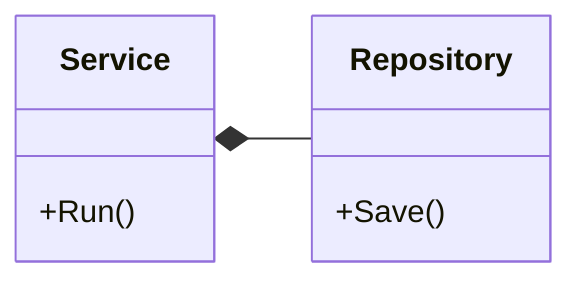
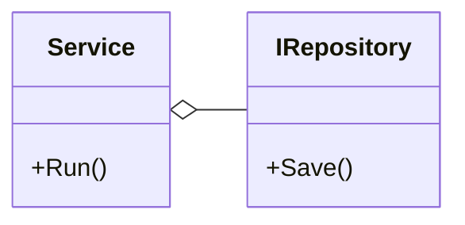
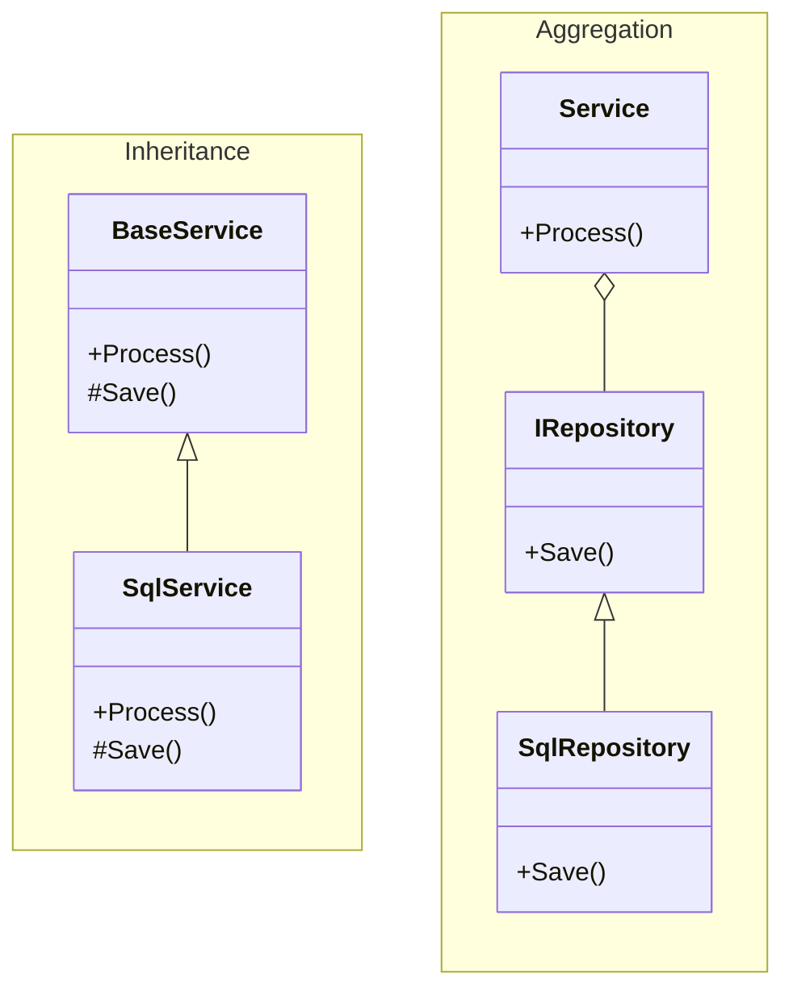

In object-oriented modeling, there are several types of relationships between classes. These relationships help express how strongly classes depend on each other, who controls whom, and what the nature of that dependency is. Understanding these distinctions is crucial for building flexible and maintainable architectures.

### Association – a preliminary link without commitment

During early design phases, it can be useful to indicate that two components interact in some way, without specifying the details. This vague kind of relationship is called an *association*. It simply signals that one object is aware of another and may use it in some capacity.

```mermaid
classDiagram
  direction LR
  class Worker {
      +Execute()
  }

  class Logger {
      +Log()
  }

  Worker --> Logger : uses
````

*Diagram 1. Directed association*

This is useful when the exact interaction logic hasn’t been defined yet—it shows that a dependency already exists, even if its form is not yet clear.

### Inheritance – a tight type-based coupling

Inheritance represents an "is-a" relationship and implies that one class fully adopts the behavior of another, possibly extending or overriding it. This allows working with a base type without knowing the exact implementation.

```mermaid
classDiagram
  direction TB
  class Repository {
      +Save()
  }

  class InMemoryRepository {
      +Save()
  }

  Repository <|-- InMemoryRepository
```

*Diagram 2. Inheritance*

While inheritance enables polymorphism, it creates a tight and static link between classes. This relationship is fixed at compile time and cannot be altered at runtime, which reduces architectural flexibility.

### Composition and Aggregation – structured dependencies

When one class uses another not as an extension of itself, but as an internal component, the relationship is "has-a" or "includes-a". Two common forms are *composition* and *aggregation*. Both describe structural containment, but differ in control and ownership.



*Diagram 3. Composition: Service manages Repository*



*Diagram 4. Aggregation: dependency via abstraction*

**Key distinction**: in composition, the outer object creates and owns the inner one; in aggregation, it receives it externally and does not control its lifecycle.

> A few tips to help remember the visual notation:
>
> * The diamond is always placed on the side of the container, with a simple line pointing to the part;
> * A filled diamond indicates a strong relationship (composition), an unfilled diamond a weaker one (aggregation).

C# examples:

```cs
class CompositeService
{
    private readonly Repository _repository = new Repository();

    public void Run()
    {
        // _repository is created internally and fully controlled
    }
}

class AggregatedService
{
    private readonly IRepository _repository;

    public AggregatedService(IRepository repository)
    {
        _repository = repository;
    }

    public void Run()
    {
        // _repository is passed from outside
    }
}
```

Composition implies tight coupling and concrete types, which may be acceptable if internal structure is stable. But when low coupling is important, aggregation through interfaces is preferred.

Sometimes, composition can be combined with abstraction—such as when using a factory:

```cs
interface IRepositoryFactory
{
    IRepository Create();
}

class Service
{
    private readonly IRepositoryFactory _factory;

    public Service(IRepositoryFactory factory)
    {
        _factory = factory;
    }

    public void Run()
    {
        var repo = _factory.Create();
        // work with repo
    }
}
```

This pattern maintains control over object lifecycle without tying the code to a specific implementation.

### The right relationship depends on context

The same problem can be approached in multiple ways depending on the designer’s preferences and flexibility requirements. Below is a comparison of two approaches—one based on inheritance, the other on aggregation:



*Diagram 5. Comparing approaches: tight inheritance vs flexible aggregation*

Flexibility increases when moving from inheritance toward aggregation, while coupling decreases.

### Architectural considerations

Deep or wide inheritance hierarchies, as well as heavy use of composition over aggregation, are signs of tight coupling between system components.

If inheritance is overused, it may indicate a disregard for proven design principles. Instead of rigid inheritance, aggregation should be favored, as it offers more runtime flexibility and simplifies behavior changes.

Heavy use of composition with concrete types also reduces adaptability. This goes against the Dependency Inversion Principle, which suggests depending on abstractions. Aggregation supports this principle by promoting external dependency injection and interface-based collaboration, instead of tightly binding to specific implementations.
