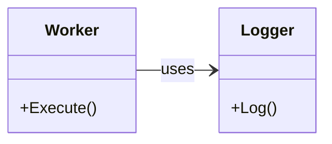
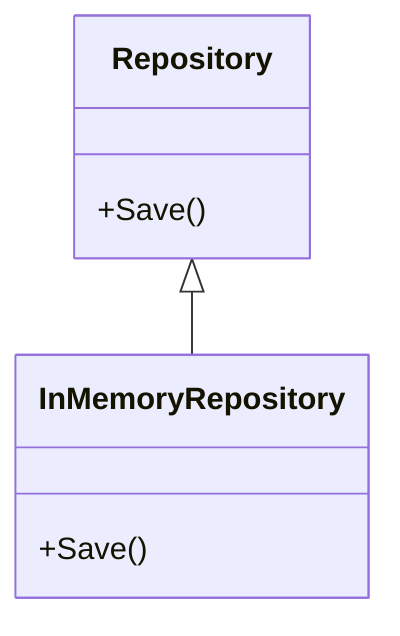
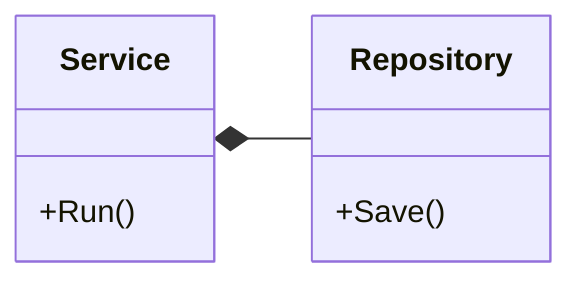
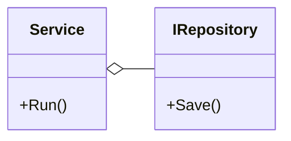
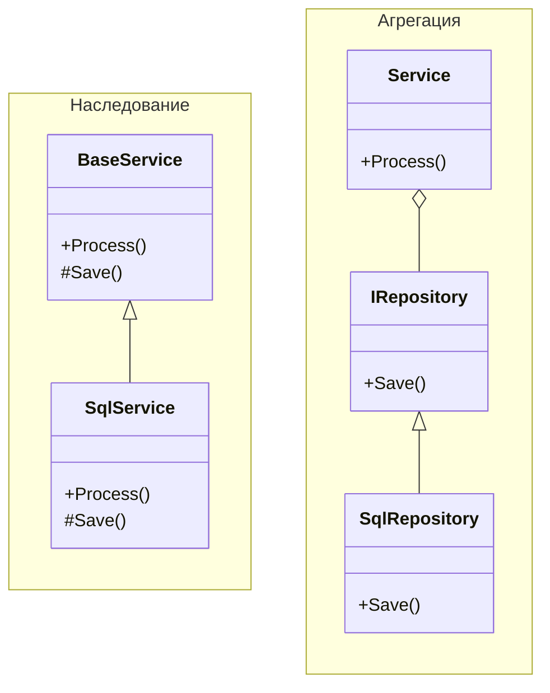

В объектно-ориентированном моделировании существуют различные формы связей между классами. Эти отношения позволяют выразить, насколько сильно классы зависят друг от друга, кто кем управляет и какова природа этой зависимости. Понимание различий между этими связями — ключ к созданию гибкой и сопровождаемой архитектуры.

### Ассоциация - предварительная связь без уточнения

На ранних этапах проектирования бывает полезно указать, что два компонента как-то взаимодействуют, не вдаваясь в детали. Такая неопределённая связь называется ассоциацией. Она лишь сигнализирует: один объект знает о другом и, возможно, использует его в работе.



*Диаграмма 1. Направленная ассоциация*

Эта форма полезна, когда логика взаимодействия ещё не определена — она показывает, что между сущностями уже есть зависимость, но её форма будет уточнена позже.

### Наследование — жёсткая связь по типу

Наследование выражает отношение "является" и предполагает, что один класс полностью разделяет поведение другого, расширяя или переопределяя его. Это позволяет работать с базовым типом, не зная конкретной реализации.



*Диаграмма 2. Наследование*

Наследование обеспечивает полиморфизм, но формирует жёсткую и статическую связь между классами. Это отношение фиксируется на этапе компиляции и не может быть изменено во время выполнения, что снижает гибкость архитектуры.

### Композиция и агрегация - составные зависимости

Когда один класс использует другой не как расширение себя, а как отдельный компонент, мы сталкиваемся с отношениями по типу "содержит" или "включает". Здесь возможны два подхода: композиция и агрегация. Оба описывают структуру вида "один содержит другого", но различаются степенью контроля.



*Диаграмма 3. Композиция: Service управляет Repository*



*Диаграмма 4. Агрегация: зависимость через абстракцию*

**Ключевое различие**: при композиции внешний объект создаёт и владеет внутренним; при агрегации — получает его извне, не управляя временем жизни.

> Пара моментов, чтобы легче запомнить визуальную нотацию:
>
> - ромбик всегда находится со стороны целого, а простая линия со стороны составной части;
> - закрашенный ромб означает более сильную связь – композицию, не закрашенный ромб показывает более слабую связь – агрегацию;

Примеры на C#:

```cs
class CompositeService
{
    private readonly Repository _repository = new Repository();

    public void Run()
    {
        // _repository создаётся внутри и полностью под контролем
    }
}

class AggregatedService
{
    private readonly IRepository _repository;

    public AggregatedService(IRepository repository)
    {
        _repository = repository;
    }

    public void Run()
    {
        // _repository передаётся извне
    }
}
```

Композиция подразумевает тесную связанность и конкретные типы, что может быть оправдано, если внутренняя структура стабильна. Но когда важно сохранить слабую связанность, предпочтительнее использовать агрегацию через интерфейсы.

Иногда можно сочетать композицию с абстракцией, например, создавая зависимость через фабрику:

```cs
interface IRepositoryFactory
{
    IRepository Create();
}

class Service
{
    private readonly IRepositoryFactory _factory;

    public Service(IRepositoryFactory factory)
    {
        _factory = factory;
    }

    public void Run()
    {
        var repo = _factory.Create();
        // работа с repo
    }
}
```

Такой подход сохраняет контроль над жизненным циклом объекта, но не фиксирует реализацию.

### Выбор связи зависит от контекста

Одна и та же задача может быть решена разными способами в зависимости от предпочтений проектировщика и требований к гибкости. Ниже сравнение двух подходов — с использованием наследования и с применением агрегации:



*Диаграмма 5. Сравнение подходов: жёсткое наследование vs гибкая агрегация*

Гибкость повышается по мере перехода от наследования к агрегации, в то время как степень связанности уменьшается.

### Архитектурные аспекты

Глубокие или разветвлённые иерархии наследования, а также преобладание композиции над агрегацией — признаки тесной связи между частями системы.

Если в архитектуре часто используется наследование, это может указывать на игнорирование проверенного практикой подхода: вместо жёсткого наследования лучше использовать агрегацию, поскольку она обеспечивает большую гибкость и упрощает изменение поведения на этапе исполнения.

Широкое применение композиции с конкретными реализациями также снижает адаптивность системы. Это идёт вразрез с принципом инверсии зависимостей, согласно которому предпочтение следует отдавать абстракциям. Агрегация как раз способствует этому подходу — она поощряет передачу зависимостей извне и их использование через интерфейсы, а не жёсткое связывание с конкретными типами.
