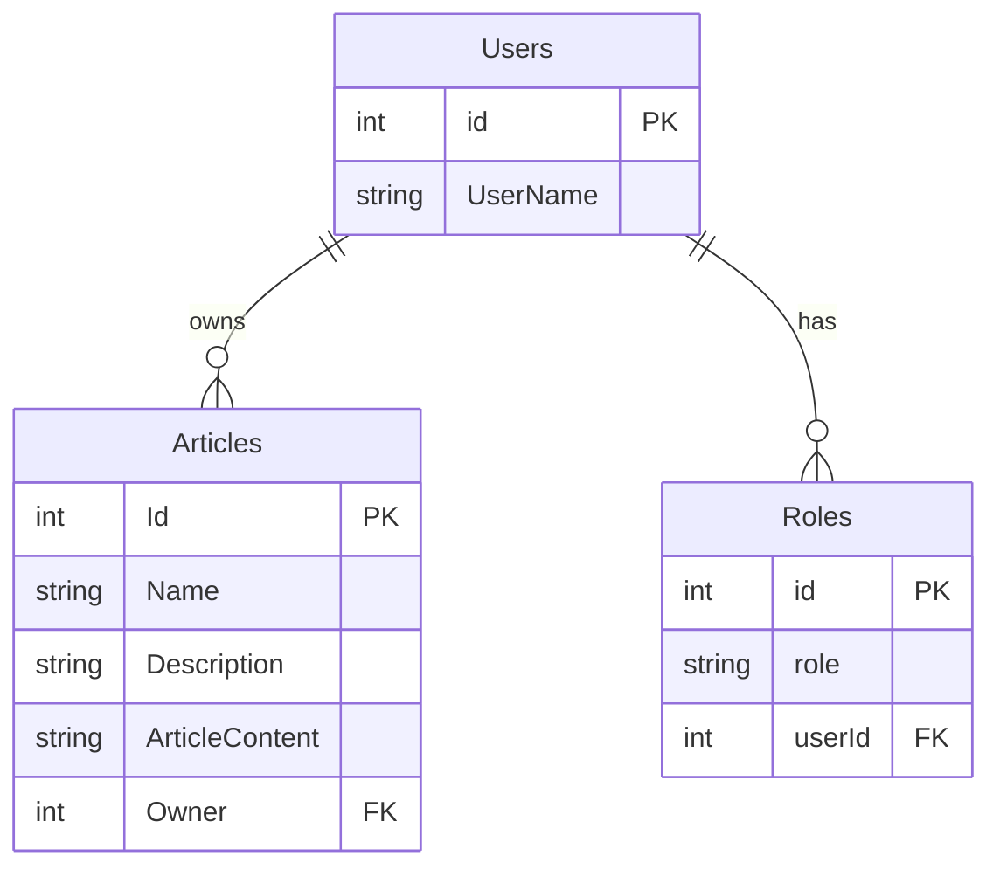

## Предисловие

Первый вариант этой статьи был написан как результат исследования, с целью нахождения гибкого механизма авторизации в корпоративном приложении, которое разрабатывала наша команда на тот момент. Стандартные решения не подходили, по причине того, что мы разрабатывали **No-Code платформу** для автоматизации бизнес-процессов для крупных компаний и государственных органов.  

Суть этой платформы заключалась в следующем: бизнес-аналитик, с помощью визуального конструктора (React) проектировал визуальный интерфейс для какой-либо сущности, - это мог быть какой-нибудь документ, типа заявления на отпуск, или информация о товаре, или данные о сотруднике. Настраивал права доступа к этой сущности, задавал бизнес-правила, а также, с помощью визуального BPMN конструктора создавал необходимые бизнес-процессы, связанные с этой и другими, ранее созданными сущностями.  

На основании этих метаданных на бакенде (ASP.NET Core) создавались динамически, на лету, объекты в базе данных - таблицы, связи, представления, индексы, ключи и т.д. (платформа поддерживала работу с MSSQL и Postgres). В дальнейшем SQL запросы к этим сущностями строились уже динамически (через `sqlkata`) по метаданным.

Соответственно, на момент компиляции приложения никакой информации о том, какие структуры данных, какие роли и правила доступа будут использоваться - их не было, так как эти вещи проектировалось бизнес-аналитиком в рантайме, в процессе ввода в эксплуатацию конечного продукта, созданного на базе нашей платформы. Ну и соответственно, ограничение доступа должно было быть не только на уровне самих сущностей (таблиц), но и на уровне  доступа к  конкретным экземплярам этих сущностей (т.е. фактически на уровне записей в таблицах).  

Одной из моих первых задач стало проектирование и реализация такой системы авторизации и разделения доступа. Достаточно гибкой, универсальной, способной адаптироваться под любые требования конечных заказчиков, любых форм и размеров, без внесения изменений в сами алгоритмы платформы, отвечающие за безопасность и авторизацию.

На момент написания статьи (начало 2021 год), это была лишь концепция, которую еще предстояло реализовать на практике.  Но сейчас, когда я пишу это предисловие (середина 2025), могу сказать задним числом, что эта концепция полностью себя оправдала, была успешно реализована и прекрасно справилась со всеми функциональными и нефункциональными требованиями. Подход вполне рабочий и жизнеспособный.

Эту статью я опубликовал на habr.com в двух частях, ссылки на них будут в конце статьи. В данной же редакции я даю ее одним текстом, убрав несущественные детали.

## Введение

Данная статья преследует цель рассказать о новом походе к авторизации в облачных решениях, в основе которого лежит использование интерпретируемого языка определения политики управления доступом - который называется [языком моделирования PERM (PML)](https://arxiv.org/abs/1903.09756). Данный язык можно использовать для выражения различных моделей управления доступом, таких как список управления доступом (`ACL`), управление доступом на основе ролей (`RBAC`), управление доступом на основе атрибутов (`ABAC`) и других. А также рассказать о практическом воплощении этого подхода в виде конкретной реализации кросс-языковой [библиотеки авторизации Casbin](https://casbin.org/)

Прежде чем приступать к рассказу, хотел выразить благодарность ключевому создателю как самого подхода, так и данной библиотеки **Casbin**, [Yang Luo](https://github.com/hsluoyz), он так же известен и как создатель еще одной, довольно известной библиотеки [Npcap](https://nmap.org/npcap/), которая с 2019 года работает под капотом утилиты Wireshark.

## Основы авторизации

В своей сути, любой, даже сложный процесс авторизации можно схематично разбить на три компонента:

- **Субъект доступа** - это человек, служба, группа пользователей, кто пытается получить доступ.
- **Объект доступа**  - это тот объект, к которому Субъект пытается получить доступ.
- **Авторизатор** - это компонент, который принимает решение, разрешить, либо запретить доступ Субъекта к Объекту.

Это можно изобразить в виде такой функциональной схемы:


_Рис.1. Принципиальная схема авторизации._

1. Субъект доступа обращается к Объекту доступа.
2. Объект доступа обращается к Авторизатору, и запрашивает бинарный ответ, разрешен ли этому Субъекту доступ к данному Объекту или нет.
3. Авторизатор по заложенной в него логике проверяет возможность доступа Субъекту к Объекту, и отвечает разрешен ли доступ или запрещен. Наиболее распространенная логическая модель по которой идет проверка доступа - это модель авторизации на базе ролей (RBAC).
4. Объект доступа на основании ответа Авторизатор разрешает, либо запрещает доступ к себе Субъекта.

## Casbin

Casbin - это библиотека авторизации, которая позволяет использовать и комбинировать различные модели управления доступом, такие как ACL, RBAC, ABAC  и д.р. С точки зрения Принципиальной схемы авторизации показанной на Рис.1 - Casbin выполняет роль Авторизатора.


_Рис.2. Принципиальная схема процесса авторизации с помощью Casbin._

Ключевым элементом механизма авторизации с помощью Casbin является **Модель политики авторизации**. Эта модель может описываться в текстовом файл *.CONF с помощью метамодели **PERM (Policy, Effect, Request, Matchers)**, ну а по сути представляет из себя коллекцию строк с определенным содержанием.  

Модель политики определяет состав кортежа с данными, который поступает в виде **запроса на авторизацию**, и описывает структуру хранения политик авторизации в **хранилище политик авторизации**, также определяет логику по которой происходит авторизации. Хранилищем может выступать как файл в формате `*.csv`, так и таблица в базе данных, впрочем как и любое другое хранилище, если для него реализован соответствующий адаптер.  

Как же было сказано, PERM - это гибкая метамодель для построения моделей авторизации. Аббревиатура расшифровывающаяся как  (Policy - Политика, Effect - Эффект, Request - Запрос, Matchers - Сопостовители). Конкретный экземпляр PERM представленный в файле .CONF, описывает, как эти 4 элемента взаимодействуют друг с другом, определяя логику авторизации.

### Пример №1. Список контроля доступа (ACL)

Лучше всего понять модель PERM на конкретном примере.

Представим, что мы создали простую CRM систему, которая хранит список клиентов, и хотим внедрить простую систему контроля доступа, чтобы контролировать кто и что может делать с ресурсом `Клиент` (client). Для этой задачи подходит модель авторизации которая называется **Список Контроля Доступа** (Access Control List - ACL).

Эту модель можно выразить в виде системных требований, представленных в следующей таблице, где определено, какие действия разрешены или запрещены пользователям с ресурсом `client`:

Пользователь/Действие | Создание (client.create)| Чтение (client.read) | Изменение (client.modify) | Удаление (client.delete)
:--- | :---: | :---: | :---: | :---:
Алиса (alice) | да| да| да|  да
Боб (bob) | нет| да| нет| да
Петр (peter)| да | да | да | нет

Теперь эту модель мы опишем в конфиг файле с именем `client_acl_model.conf` на основе метамодели PERM, и дальше разберем каждую секцию

```ini
[request_definition]
r = sub, obj, act

[policy_definition]
p = sub, obj, act

[policy_effect]
e = some(where (p.eft == allow))

[matchers]
m = r.sub == p.sub && r.obj == p.obj && r.act == p.act
```

Каждая секция модели описывается в формате `ключ = значение`. Каждой секции соответствует свой ключ.

В первую очередь в секции `[request_definition]` идет определение структуры запроса (`r`). Здесь мы указываем, что каждый запрос будет представлять из себя кортеж из трех элементов, в котором первый элемент будет связан с атрибутом по имени `sub` (субъект), второй `obj` (объект), и третий `act` (действие). Пример правильного запроса, основанного на этом определении, является массив значений: `["alice","client","read"]` (может ли `alice` `read` `client`?).

Дальше идет секция `[policy_definition]` для определения структуры хранения политики. Как правило, она повторяет структуру запроса. Дополнительно, все правила политики имеют дополнительный  предопределенный атрибут `eft`, и он может принимать только значение `allow` (разрешено)  или  `deny` (запрещено). В данном случае, при определении достаточно простой модели политики ACL мы можем его не указывать, это будет избыточно.

Следующая секция `[policy_effect]`,  определяет, следует ли разрешить или запретить доступ, если запросу соответствует несколько политик авторизации. В данной модели мы используем следующий эффект политики для нашей CRM `e = some(where (p.eft == allow))`, что означает: если есть какое-либо подходящее разрешающее правило политики типа `allow` (например,`eft` == "allow"), конечным эффектом будет `allow` (разрешить). Это конструкция также означает, что если совпадений нет или все совпадения относятся к типу `deny` (запрещено), конечный эффект будет `deny`.

В разделе `[matchers]` мы указываем логическое выражение, где определяем правила соответствия **запроса** (`r`) заданному правилу **политики** (`p`).
В данном случае мы указываем, что первому атрибуту **запроса** `r.sub` должен соответствовать первый атрибут **политики** `p.sub` и (`&&`) соответственно второму атрибуту запроса должен соответствовать второй атрибут политики `r.obj == p.obj`, и третьему атрибуту запроса должен соответствовать третий атрибут в политики `r.act == p.act`.

Модель политики авторизации мы определили. Следующий шаг - необходимо определить **правила политики** на основе системных требований и определения политики указанных в разделе [policy_definition] конфигурационного файла модели. Мы можем поместить эти правила в базу данных или, в нашем случае, в файл `* .csv` с именем `client_acl_policy.csv`:

```ini
p, alice, client, create
p, alice, client, read
p, alice, client, modify
p, alice, client, delete

p, bob, client, read

p, peter, client, create
p, peter, client, read
p, peter, client, modify
```

Следует обратить внимание, что, прежде всего, поскольку мы не указываем значение атрибута eft ни для одного из вышеперечисленных правил, все наши правила по умолчанию имеют тип `allow` (разрешено). Во-вторых, мы не должны определять какие-либо  `deny` правила для нашей системы.
Так как именно такую логику обработки правил мы заложили в нашем конфигурационном файле модели.

Следующий шаг - объединить модель политики, правила политики и саму библиотеку Casbin для создания в нашей CRM системы контроля доступа.

Для примера, я буду использовать код на C#, но в принципе он достаточно прост, и интуитивно понятен, даже для тех, кто его не знает.
Для платформы .net Casbin представлен в виде класса `Enforcer`, который имеет множество конструкторов, но в простом виде, он принимает в конструктор две строковых переменные, указывающие путь к файлам с моделью и правилами политики.

```cs
// Создадим новый экземпляр класса Enforcer
var e = new Enforcer("path/to/client_acl_model.conf", "path/to/client_acl_policy.csv");

// Определим переменные, которые укажем в запросе авторизации
var sub = "alice";
var obj = "client";
var act = "read";

// Выполняем проверку  
if (e.Enforce(sub, obj, act)) {
    // доступ alice к чтению объекта client разрешен
} else {
    // отклонить запрос, показать ошибку
}
```

### Пример №2. Контроль доступа на основе ролей (RBAC)

Наша система авторизации отлично работает для простых сценариев, по ходу увеличения числа пользователей, утомительно каждому из них назначать разрешения, особенно если этих разрешений несколько. Поэтому мы разработали новую версию системы контроля доступа, на базе ролей, показанную на следующей схеме.


_Рис.3. Схема ролей доступа (RBAC)._

Мы назначаем разные роли разным пользователям. Пользователю `bob` назначена роль читателя (`reader`), `peter` является автором (`author`), а `alice` теперь админ CRM (`admin`).
Затем для каждой роли мы определяем разрешения (вместо того, чтобы спрашивать, _какой пользователь что может делать?_, как это описано в модели ACL, теперь мы задаемся вопросом **какая роль что может делать?**). Мы также наследуем одну роль от другой, тем самым наши роли поддерживают [транзитивность](https://ru.wikipedia.org/wiki/%D0%A2%D1%80%D0%B0%D0%BD%D0%B7%D0%B8%D1%82%D0%B8%D0%B2%D0%BD%D0%BE%D1%81%D1%82%D1%8C). На приведенной выше диаграмме мы от читателя наследуем автора, а от автора наследуем администратора, и каждый наследник обладает теми же разрешениями что и родитель и плюс своими собственными.  

Исходя из этого дизайна, конфигурационный файл `client_rbac_model.conf` для нашей новой модели политики будет выглядеть так:

```ini
[request_definition]
r = sub, obj, act

[policy_definition]
p = sub, obj, act

[role_definition]
g = _, _

[policy_effect]
e = some(where (p.eft == allow))

[matchers]
m = g(r.sub, p.sub) && r.obj == p.obj && r.act == p.act
```

Здесь мы видим, что у нас появилась новая секция `[role_definition]` для определения ролей. Выражение  `g = _, _` говорит о том, что в секции `[matchers]` мы будем сопоставлять два значения - `r.sub` и `p.sub`, но их может быть и больше, если допустим наше приложение будет поддерживать [мультитенантность](https://habr.com/ru/company/microsoft/blog/145027), и это необходимо будет учитывать при авторизации. Но об этом дальше.

Еще одно отличие, от модели ACL - мы изменили в секции `[matchers]` эту часть `r.sub == p.sub` на выражение `g (r.sub, p.sub)`, что можно прочитать как: _если `r.sub` имеет роль (или наследуется от) `p.sub`_.

Содержимое файла `client_rbac_policy.csv` с правилами политики для такой модели будут выглядеть так:

```ini
p, reader, client, read
p, author, client, modify
p, author, client, create
p, admin, client, delete

g, bob, reader
g, peter, author
g, alice, admin

g, author, reader
g, admin, author
```

Пример использования в коде приложения не отличается от предыдущего примера c ACL, за исключением путей к файлам модели и правил политики:

```cs
var e = new Enforcer("path/to/client_rbac_model.conf", 
    "path/to/client_rbac_policy.csv");

var sub = "alice";
var obj = "client";
var act = "read";

// Выполняем проверку  
if (e.Enforce(sub, obj, act)) {
    // доступ alice к чтению объекта client разрешен
} else {
    // отклонить запрос, показать ошибку
}
```

### Пример №3. Контроль доступа на основе ролей с поддержкой мультитенатности (RBAC with domains/tenants)

По мере дальнейшего развития нашего приложения CRM, им заинтересовались другие компании, и мы добавили в нашу таблицу с клиентами новый столбец - компания, в который записываем имя копании, которой принадлежит этот клиент, и на основании этого значения отображаем каждой компании только принадлежащих ей клиентов, скрывая клиентов других компаний. Bob ушел в другую компанию, и там стал администратором нашей CRM.

Для поддержки мультитенатности, мы просто добавляем еще один атрибут в кортеж запроса на авторизацию, и в структуру описания правила политики в конфигурационном файле модели `client_rbac_with_domain_model.conf`. А в дальнейшем при определении роли, и при указании правил сопоставления, учитываем этот атрибут.

```ini
[request_definition]
r = sub, dom, obj, act

[policy_definition]
p = sub, dom, obj, act

[role_definition]
g = _, _, _

[policy_effect]
e = some(where (p.eft == allow))

[matchers]
m = g(r.sub, p.sub, r.dom) && r.dom == p.dom && r.obj == p.obj && r.act == p.act
```

В сравнении с моделью описанной в примере №2 (RBAC) здесь мы видим что в секции `[request_definition]` и `[policy_definition]` у нас добавился новый атрибут `dom`, в который передается название компании, к которой принадлежит субъект, который хочет авторизоваться.  
Так же мы изменили секцию `[role_definition]`, добавив еще одно измерение для выяснения принадлежности роли субъекту с учетом компании, к которой он принадлежит, `g = _, _` заменили на `g = _, _, _`.  
И в разделе `[matchers]` часть выражения `g(r.sub, p.sub)`  заменили на `g(r.sub, p.sub, r.dom) && r.dom == p.dom`, что можно прочитать как: _если `r.sub` имеет роль (или наследуется от) `p.sub` c учетом значения атрибута запроса `r.dom`, и атрибуту запроса `r.dom`, соответствует атрибут политики `p.dom`_.

Содержимое файла `client_rbac_with_domain_policy.csv` с правилами политики для такой модели может выглядеть так:

```ini
p, reader, company1, client, read
p, author, company1, client, modify
p, author, company1, client, create
p, admin, company1, client, delete

p, reader, company2, client, read
p, author, company2, client, modify
p, author, company2, client, create
p, admin, company2, client, delete

g, author, reader, company1
g, admin, author, company1

g, author, reader, company2
g, admin, author, company2

g, alice, admin, company1
g, peter, author, company1

g, bob, admin, company2
```

### Пример №4. Контроль доступа на базе модели RESTFul

Данная модель поддерживает возможность реализовывать логику авторизации, когда в качестве объектов доступа выступают ресурсы RestAPI интефрейса в формате URI в виде `/res/*`,`/res/:id`, а в качестве действий такие методы HTTP как `GET`,`POST`,`PUT`,`DELETE`.  
Данная возможность обеспечивается благодаря использованию встроенных и пользовательских [функций](https://casbin.org/docs/en/function) и регулярных выражений в разделе [matchers].  
Конфигурационный файл в такой модели будет иметь следующий вид (здесь я использую официальный пример из Casbin):

```ini
[request_definition]
r = sub, obj, act

[policy_definition]
p = sub, obj, act

[policy_effect]
e = some(where (p.eft == allow))

[matchers]
m = r.sub == p.sub && keyMatch(r.obj, p.obj) && regexMatch(r.act, p.act)
```

а файл с определением правил политики:

```ini
p, alice, /alice_data/*, GET
p, alice, /alice_data/resource1, POST

p, bob, /alice_data/resource2, GET
p, bob, /bob_data/*, POST

p, cathy, /cathy_data, (GET)|(POST)
```

### Пример №5. Контроль доступа на базе атрибутов (ABAC)

Идея, заложенная в модели `ABAC` достаточно проста, и заключается в том, что политики авторизации строятся не на ролях, а на атрибутах субъектов, объектов доступа, атрибутов операций и атрибутов среды (атрибуты ABAC). Наиболее распространен достаточно сложный стандарт языка управления доступом ABAC под названием [XACML](https://habr.com/ru/company/custis/blog/258861). По сравнению с ним, модель ABAC реализованная в Casbin достаточно проста: есть возможность использовать структуры или экземпляры классов, вместо строковых значений атрибутов модели.  
Здесь, как и в предыдущем примере, я буду использовать официальный пример из документации Casbin.  
Вот пример модели политики на базе ABAC:

```ini
[request_definition]
r = sub, obj, act

[policy_definition]
p = sub, obj, act

[policy_effect]
e = some(where (p.eft == allow))

[matchers]
m = r.sub == r.obj.Owner
```

Этот пример мало отличается описанных выше, за исключением того, что при сопоставлении в разделе [matchers], мы значение атрибута запроса `r.sub` сопоставляем с со свойством `Owner` экземпляра класса, который мы передаем в атрибут запроса `r.obj`, при вызове метода `e.Enforce()`. В данном случае при сопоставлении, Casbin будет использовать механизм Reflection, чтобы получить из переданного экземпляра класса значение свойства `Owner`.  
Тогда класс, экземпляр которого мы будем передавать в качестве значения для атрибута `r.obj`, будет иметь следующую структуру:

```cs
public class ResourceObject  
{
    ...
    public string Owner { get; set; }
}
```

Можно использовать несколько атрибутов ABAC при сопоставлении, например:

```cs
[matchers]
m = r.sub.Domain == r.obj.Domain
```

В настоящее время, в качестве источников атрибутов ABAC для сопоставления могут выступать только элементы запроса на авторизацию (`r`), такие как `r.sub`, `r.obj`, `r.act` и т.д.
Нельзя в качестве источников атрибутов ABAC использовать элементы политики (`p`), такие как например `p.sub`, `p.obj` и т.д., так как нет способа определить класс или структуру в политике Casbin.

Но для более сложных сценариев с использованием ABAC, существует возможность описать правила ABAC в политике Casbin, чтобы не увеличивать многословность логического выражения в секции `[matchers]` модели.  
Это достигается путем введения в модель функциональной конструкции `eval()` и называется - масштабированием модели.

Пример конфигурации модели политики `abac_scale_model.conf` с использованием масштабирования:

```ini
[request_definition]
r = sub, obj, act

[policy_definition]
p = sub_rule, obj, act

[policy_effect]
e = some(where (p.eft == allow))

[matchers]
m = eval(p.sub_rule) && r.obj == p.obj && r.act == p.act
```

Здесь в разделе `[policy_definition]` модели, мы определяем новый атрибут `sub_rule`, а в секции `[matchers]` используем конструкцию `eval(p.sub_rule)`. В данном случае `p.sub_rule` представляет из себя определяемый пользователем тип (класс или структура), который содержит необходимые свойства, которые будут использоваться при определении политики.

Файл `abac_scale_policy.conf` с правилами политики:

```ini
p, r.sub.Age > 18, client1, read
p, r.sub.Age < 60, client2, write
```

Ну и в коде это будет выглядеть так:

```cs
public class User  
{
    public int Age { get; set; }
    public string Name { get; set; }
}

class Program
{
    static void Main(string[] args)
    {
        
        var e = new Enforcer("path/to/abac_scale_model.conf", 
            "path/to/abac_scale_policy.csv");
        
        var sub = new User() { Name = "alice", Age = 19 };
        var obj = "client1";
        var act = "read";

        if (e.Enforce(sub, obj, act)) {
            // доступ alice к чтению объекта client1 разрешен
        } else {
            // отклонить запрос, показать ошибку
        }
    }
}
```

## Практический пример для реального приложения

Представим, что мы разрабатываем механизм авторизации для CMS, в которую пользователи через административную панель могут добавлять статьи. В админке пользователь с ролью `user` может видеть только свои статьи.  Статьи других людей он не может видеть, если только ему не присвоена роль `admin` или `supervisor`. `supervisor` может видеть и редактировать все статьи, а `admin` имеет все те же права что и `supervisor`, но кроме этого, еще может и удалять любые статьи.

Сначала попробовать использовать классический подход, с помощью SQL запросов. А затем решим задачу авторизации с помощью **Casbin**.

### Структура, схема и содержимое БД

Структура БД нашей CMS:  



Содержимое таблицы пользователей - **Users**:

id | UserName
--- | ---
1 | Alice
2 | Bob
3 | Peter

Пользователям присвоены следующие роли - **Roles**:

id | role | userId
--- | --- | ---
1 | admin | 3
2 | supervisor | 2
3 | user | 1

Как мы видим, **Piter** является администратором, а **Bob** - супервизором. **Alice** обычный пользователь, может видеть, создавать и редактировать только свои статьи.

Содержимое таблицы со статьями - **Articles**:

Id | Name | Description | ArticleContent | Owner
--- | --- | --- | --- | ---
1 | A | A | A | 1
2 | A1 | A1 | A1 | 1
3 | A1 | A1 | A1 | 1
4 | B | B | B | 2
5 | B1 | B1 | B1 | 2
6 | B2 | B2 | B2 | 2
7 | P | P | P | 3
8 | P1 | P1 | P1 | 3

### Классический подход

Я не буду подробно останавливаться на том как решить все кейсы, покажу  только то, как сделать выбору с учетом всех требований с помощью `SQL`.

Выборка осуществляется для администратора (Piter, id=3) таким образом:

```sql
select * from articles a
left join roles r on r.userId = 3
where a.owner = 3
OR (r.role in ('admin', 'supevisor'))
```

Результат выборки для администратора:

Id | Name | Description | ArticleContent | Owner | id | role | userId
--- | --- | --- | --- | --- | --- | --- | ---
1 | A | A | A | 1 | 1 | admin | 3
2 | A1 | A1 | A1 | 1 | 1 | admin | 3
3 | A1 | A1 | A1 | 1 | 1 | admin | 3
4 | B | B | B | 2 | 1 | admin | 3
5 | B1 | B1 | B1 | 2 | 1 | admin | 3
6 | B2 | B2 | B2 | 2 | 1 | admin | 3
7 | P | P | P | 3 | 1 | admin | 3
8 | P1 | P1 | P1 | 3 | 1 | admin | 3

Выборка для супервизора (Bob, id=2) таким образом:

```sql
select * from articles a
left join roles r on r.userId = 2
where a.owner = 2
OR (r.role in ('admin', 'supevisor'))
```

Результат выборки для супервизора:

Id | Name | Description | ArticleContent | Owner | id | role | userId
--- | --- | --- | --- | --- | --- | --- | ---
1 | A | A | A | 1 | 2 | supevisor | 2
2 | A1 | A1 | A1 | 1 | 2 | supevisor | 2
3 | A1 | A1 | A1 | 1 | 2 | supevisor | 2
4 | B | B | B | 2 | 2 | supevisor | 2
5 | B1 | B1 | B1 | 2 | 2 | supevisor | 2
6 | B2 | B2 | B2 | 2 | 2 | supevisor | 2
7 | P | P | P | 3 | 2 | supevisor | 2
8 | P1 | P1 | P1 | 3 | 2 | supevisor | 2

Выборка для пользователя (Alice, id=1) выглядит так:

```sql
select * from articles a
left join roles r on r.userId = 1
where a.owner = 1
OR (r.role in ('admin', 'supevisor'))
```

Результат выборки для пользователя:

Id | Name | Description | ArticleContent | Owner | id | role | userId
--- | --- | --- | --- | --- | --- | --- | ---
1 | A | A | A | 1 | 2 | user | 1
2 | A1 | A1 | A1 | 1 | 2 | user | 1
3 | A1 | A1 | A1 | 1 | 2 | user | 1

Теперь попробуем использовать подход к авторизации, на базе библиотеки Casbin.

### Подход с использованием Casbin

Для начала давайте определимся что ресурс в подходе PERM - это не _**экземпляр сущности**_, а сама **сущность**.
Т.е. когда мы описываем модель авторизации, под ресурсом в нашем примере подразумевается сама сущность (таблица) Статья. А не конкретная запись из этой таблицы (с Id=1 например).

Дальше необходимо уточнить, что те роли, которые используются в описании этой задачи - это не классические роли из подхода RBAC.
Роли RBAC описывают те разрешения, которые можно выполнить с сущностью. Например в классическом RBAC роль `user` могла бы только читать статьи, роль `author` могла бы  наследовала роль `user` (т.е. чтение статей), и еще могла бы редактировать и создавать новые статьи, а роль `admin` могла бы наследовать все предыдущие разрешения и плюс еще удалять статьи.

В описанной же нами выше задаче, по сути, все эти все роли не отличаются друг от друга. И `user` и `supervisor` и `admin` имеют одни и те же права, один набор разрешений - каждый носитель любой из ролей может создавать, редактировать или удалять статьи. Разница только в области видимости, `user` может видеть в админке только свои статьи, и соответственно редактировать их и удалять. А `admin` и `supervisor` видят не только свои, но еще и чужие, плюс `admin` может еще и удалять чужие статьи.

И в этом заключается большой минус модели RBAC, так это статичная модель авторизации, и с ее помощью вообще невозможно выразить  бизнес-правила, в которых используются атрибуты, значения которых заранее не известны и вычисляются в процессе работы.
Об этом подробно уже было рассказано в статье [Подходы к контролю доступа: RBAC vs. ABAC](https://habr.com/ru/company/custis/blog/248649/)

А те роли, что мы используем (`user`, `supervisor`, `admin`) - это так называемые - `динамические роли` (контекстно-зависимые роли (Contextual Roles)). Они реализуются различными способами, приведенное выше "классическое решение" - один из таких подходов.

#### Выборка значений с учетом "динамических ролей"

Для начала давайте определим  модель политики RBAC (`rbac_model.conf`), ее подробное описание я привел в предыдущей статье:

```ini
[request_definition]
r = sub, obj, act

[policy_definition]
p = sub, obj, act

[role_definition]
g = _, _

[policy_effect]
e = some(where (p.eft == allow))

[matchers]
m = g(r.sub, p.sub) && r.obj == p.obj && r.act == p.act
```

Далее, мы убираем таблицу ролей **Roles**. Роли у нас теперь будут описаны в хранилище политик. Это может быть как обычный `*.csv` файл, так и таблица в базе данных. Для простоты я буду использовать cvs файл `rbac_policy.csv`:

```ini
p, user, article, read
p, user, article, modify
p, user, article, create
p, user, article, delete

g, supervisor, user
g, admin, supervisor

g, 1, user
g, 2, supervisor
g, 3, admin
```

Суть здесь такая, что мы даем роли `user` права на чтение, модификацию, создание и удаление статей. Затем роль `supervisor` наследует права роли `user.` А роль `admin` наследует права роли `supervisor`.
Далее пользователю alice(1) мы присваиваем роль `user`, bob(2) у нас `supervisor`, а piter(3) - `admin`.
В принципе этого достаточно, чтобы решить проблему выборки записей с помощью модели PERM.

Дальше я покажу как эту модель использовать на C#:

```cs
public IList<Article> GetArticlesForAdminPanel(int currentUserId)
{
    var e = new Enforcer("CasbinConfig/rbac_model.conf", 
        "CasbinConfig/rbac_policy.csv");

    var obj = "article";
    var act = "read";

    //Сначала проверяем, что пользователь имеет права на чтение статей
    if (e.Enforce(currentUserId.ToString(), obj, act))
    {
        //Получаем список ролей пользователя
        var currentUserRoles = e.GetRolesForUser(currentUserId.ToString());
        //Проверяем, является ли пользователем админиом или супервизором
        var isAdmin = currentUserRoles.Any(x => 
            x == "admin" || x == "supervisor");

        //Если админ, вернуть все записи, иначе только те, которые принадлежат пользователю
        if (!isAdmin) 
            return _context.Articles.Where(x => 
            x.OwnerId == currentUserId).ToList();
        else 
            return _context.Articles.ToList();
    }
    else
    {
        // отклонить запрос, показать ошибку
        throw new Exception("403. У вас нет прав для чтения статей");
    }
}
```

Проблема выборки записей с учетом контекстно-зависимых родей решена.

#### Редактирование статей с учетом "динамических ролей"

Теперь же пойдем еще дальше. Мы получили список статей, отобразили в админке, и попытаемся отредактировать какую-нибудь статью. И нам соответственно надо проверить, имеем ли мы права чтобы ее отредактировать, пользователь с ролью `user` может отредактировать только свои статьи, `supervisor` и `admin` могут отредактировать все статьи.

Для этого определяем новую модель, называем ее `rbac_with_abac_model.conf`:

```ini
[request_definition]
r = sub, obj, act

[policy_definition]
p = sub, obj, act

[role_definition]
g = _, _

[policy_effect]
e = some(where (p.eft == allow))

[matchers]
m = (r.sub == r.obj.OwnerId.ToString() || g(r.sub, "supervisor")) && g(r.sub, p.sub) && r.act == p.act
```

Данная модель не сильно отличается от модели чтения, за исключением секции `[matchers]`, в ней мы конструкцию  `r.obj == p.obj` заменили на `(r.sub == r.obj.OwnerId.ToString() || g(r.sub, "supervisor"))`. Это следует читать как _r.sub (id пользователя) должен совпадать с полем r.obj.OwnerId (id владельца обновляемой записи) или r.sub должен принадлежать группе "supervisor"_. Поскольку группа `admin` наследует все права группы `supervisor` то и члены группы `admin` будут соответствовать этому правилу.

Файл с политиками остается прежним, его мы не меняем. Теперь смотрим как это выглядит в коде:

```cs
public void UpdateArticle(int currentUserId, Article newArticle)
{
    var e = new Enforcer("CasbinConfig/rbac_with_abac_model.conf",
        "CasbinConfig/rbac_policy.csv");

    var act = "modify";

    //Проверяем, что пользователь имеет права на редактирование статьи
    if (e.Enforce(currentUserId.ToString(), newArticle, act))
    {
        //Обновляем, и сохраняем изменения
        _context.Articles.Update(newArticle);
        _context.SaveChanges();
    }
    else
    {
        // отклонить запрос, показать ошибку
        throw new Exception("403. Недостаточно прав");
    }
}
```

Тут нам стоит обратить внимание на то, что мы в метод `e.Enforce` передаем вторым параметром объект, который представляет из себя экземпляр класса `Article`.

Ну и последний шаг - попытаемся удалить статью.

#### Удаление статьи

Бизнес-правило у нас здесь такое, что пользователь с ролью `user` может удалить свою статью, `supervisor` - не имеет прав удалять чужие статьи, а `admin` такое право имеет.
Опишем теперь это бизнес-правило в модели политики PERM, в файле `delete_model.conf`:

```ini
[request_definition]
r = sub, obj, act

[policy_definition]
p = sub, obj, act

[role_definition]
g = _, _

[policy_effect]
e = some(where (p.eft == allow))

[matchers]
m = (r.sub == r.obj.OwnerId.ToString() || g(r.sub, "admin")) && g(r.sub, p.sub) && r.act == p.act
``` 

Она не сильно отличается от предыдущей политике редактирования, за тем исключением, что удалять чужие статьи мы разрешили только роли `admin`. Если носитель роли `supervisor` попытается удалить чужую статью, у него выйдет ошибка превышения полномочий.

Как и в случае с моделью, код мало чем отличается от предыдущего примера на редактирование:

```cs
public void DeleteArticle(int currentUserId, Article deleteArticle)
{
    var e = new Enforcer("CasbinConfig/delete_model.conf", 
        "CasbinConfig/rbac_policy.csv");

    var act = "delete";

    //проверяем, что пользователь имеет права на удаление статьи
    if (e.Enforce(currentUserId.ToString(), deleteArticle, act))
    {
        //Удаляем статью
        _context.Articles.Remove(deleteArticle);
        _context.SaveChanges();
    }
    else
    {
        // отклонить запрос, показать ошибку
        throw new Exception("403. Недостаточно прав");
    }
}
```

### Резюме

**Библиотека Casbin** - очень гибкое и универсальное решение для авторизации, благодаря использованию интерпретируемого языка определения политики управления доступом называемый **языком моделирования PERM (PML)**. Она позволяет использовать как существующие, наиболее распространенные модели управления доступом, так и комбинировать их, либо создавать новые.

В основе Casbin лежит интерпретатор модели политики (`policy model`) описанной с помощью **языка PERM**, который сопоставляет значения переданные в качестве атрибутов запроса на авторизацию, с правилами политики (`policy`) полученными из хранилища политик безопасности.
Библиотека реализована для множества существующих наиболее распространенных языков программирования.

Надеюсь, приведенные примеры продемонстрировали  гибкость, универсальность и удобство использования **библиотеки Casbin и языка PERM** для построения решений по разделению доступа и авторизации.  

Еще отмечу, что как сами модели политики, так и правила политики могут храниться в БД. И предусмотрена [возможность фильтрации правил](https://casbin.org/docs/en/policy-subset-loading), если их большое множество, и это может стать узким местом в высоконагруженных приложениях.

Casbin для .net под капотом использует библиотеку [DynamicExpresso.Core](https://github.com/davideicardi/DynamicExpresso) для интерпретации простых выражений C# при сопоставлении правил политик с входными значениями, что позволяет эффективно использовать Casbin даже в самых сложных сценариях авторизации.

Не смотря на свою молодость, Casbin активно развивается, используется во множестве проектов, обрастает полезными инструментами и API. Такими например как [UI для управления политиками](https://casbin.org/docs/en/admin-portal).

Полностью работоспособный и самодостаточный код примера, который я использовал для написания данной статьи я [разместил у себя на Github](https://github.com/pprometey/casbin-demo), можете скачать и поиграться, если есть интерес и желание.

## Источники и полезные ссылки
- [Официальный сайт библиотеки Casbin](https://casbin.org)
- [Список адаптеров к хранилищам, где можно хранить правила политик](https://casbin.org/docs/en/adapters)
- [Способы загрузки модели политики в класс Enforcer](https://casbin.org/docs/en/model-storage)
- [Интеграция Casbin c ASP.NET Core, для авторизации через атрибуты контроллеров](https://github.com/casbin-net/casbin-aspnetcore)
- [Подходы к контролю доступа: RBAC vs. ABAC](https://habr.com/ru/company/custis/blog/248649)
- [Casbin for Elixir](https://github.com/casbin/casbin-ex)
---
- Первая часть оригинальной статьи на Хабре - [RBAC? ABAC?.. PERM! Новый подход к авторизации в облачных веб-службах и приложениях](https://habr.com/ru/post/539778/)
- Вторая часть - [Гибкая авторизация с помощью Casbin и PERM. Практический пример](https://habr.com/ru/articles/540454/)