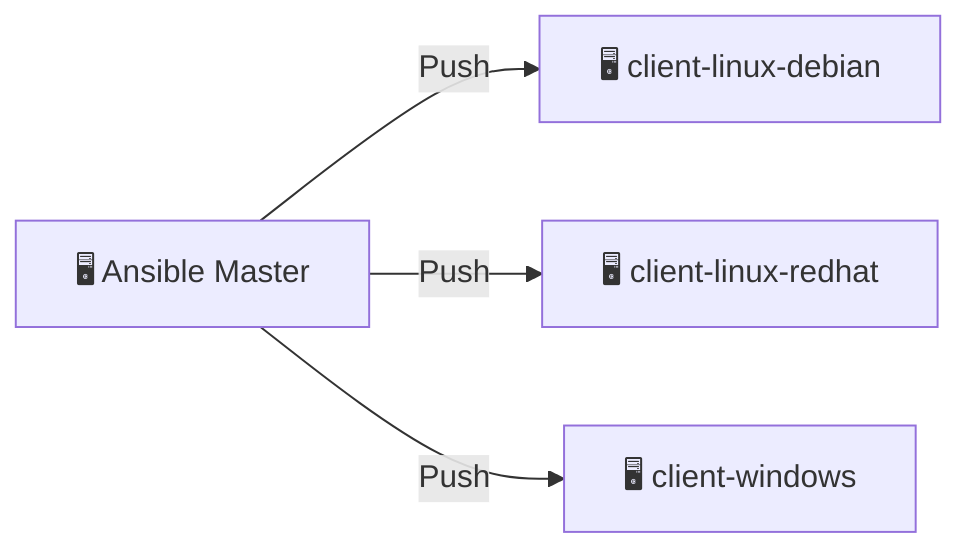
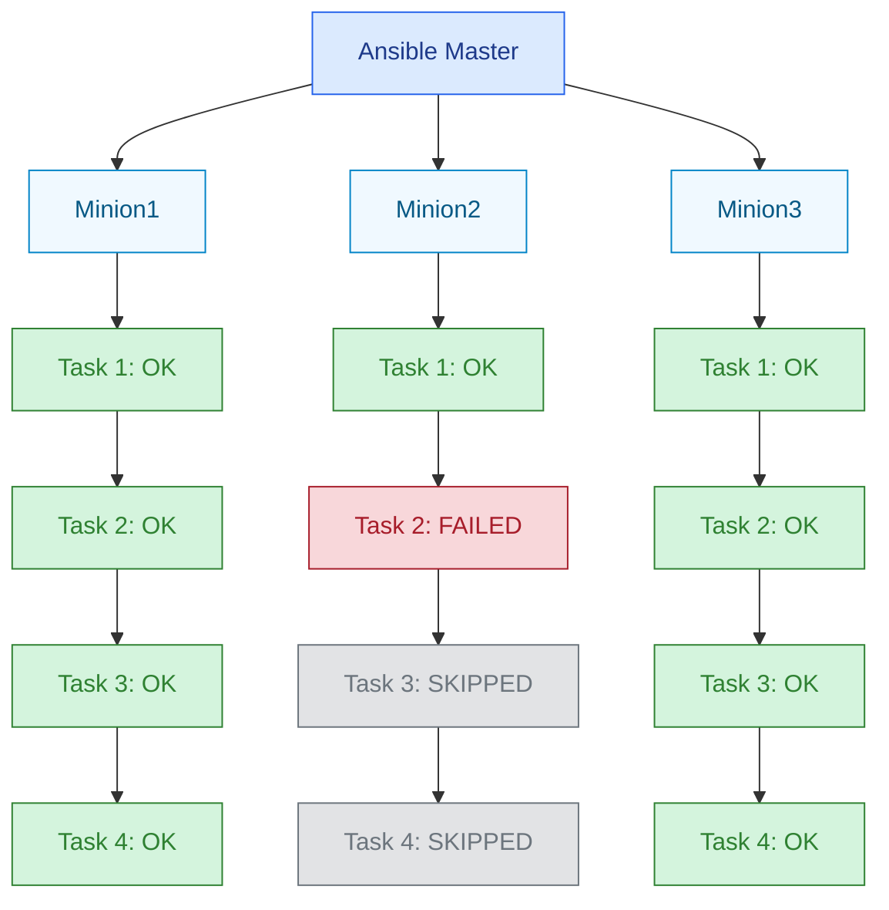
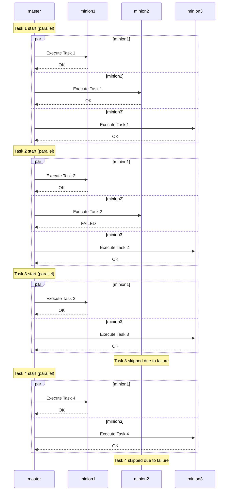

## Introduction

This Ansible fundamentals course is built around an isolated environment using Docker containers, Visual Studio Code, and the Dev Containers extension. This setup allows you to quickly spin up a fully functional learning platform without installing anything unnecessary on your main system.

To get the most out of this course, it’s highly recommended that you follow each step manually and create all required artifacts yourself. This hands-on approach will help you gain a deeper understanding of the processes and better retain the key concepts.

- Start from scratch with the empty course template:  
  <https://github.com/pprometey/ansible-tutorial-lab>
- Or explore the full course project with all artifacts and development history:  
  <https://github.com/pprometey/ansible-tutorial-project>

Вот адаптированный и естественный перевод для англоязычной аудитории:

### How to Use This Environment for the Course

1. **Install Docker Desktop**

Follow the official installation guide for Windows, macOS, or Linux:  
<https://docs.docker.com/get-docker/>

2. **Clone the Course Repository**

```bash
git clone https://github.com/pprometey/ansible-tutorial-lab.git
```

Navigate to the cloned directory. This will be your project root:

```bash
cd ansible-tutorial-lab
```

3. **Set the Environment Variable for SSH Keys**

- **Windows (PowerShell):**

```powershell
[System.Environment]::SetEnvironmentVariable("DEFAULT_SSH_KEY", "<path_to_key_folder>", "User")
```

After that, restart all VS Code windows.

- **macOS/Linux (bash):**

Add the following to your `~/.bashrc` or `~/.zshrc`:

```bash
export DEFAULT_SSH_KEY="<path_to_key_folder>"
```

Then run:

```bash
source ~/.bashrc
```

or simply restart the terminal.

The specified folder should contain two files: `id_rsa` and `id_rsa.pub` – your private and public SSH keys, which Ansible will use to connect to the target nodes.

4. **Verify That the Variable Is Set**

- Windows (PowerShell):

```powershell
$env:DEFAULT_SSH_KEY
```

- macOS/Linux (bash):

```bash
echo $DEFAULT_SSH_KEY
```

5. **Launch the Isolated Environment in VS Code Using Remote - Containers**

- Open VS Code in the project folder using `code .`
- [Install the **Remote - Containers** extension](https://marketplace.visualstudio.com/items?itemName=ms-vscode-remote.remote-containers) if it's not already installed.
- Press `F1` and select **Remote-Containers: Reopen in Container**.

This will launch the containers with the Ansible control node and target nodes, ready for use.

## What Is Ansible

**Ansible** is a configuration management tool that follows a *push-based* model: the control node initiates SSH connections to managed hosts and applies configurations without requiring any additional software to be installed on those hosts.

There are two main models for configuration management:

- **Pull model** – Agents are installed on managed hosts, which periodically fetch configurations from a central server (e.g., *Chef*, *Puppet*, *SaltStack*).
- **Push model** – The control server actively connects to the hosts and pushes configuration changes to them (e.g., *Ansible*).



### Minimum Requirements

**Control Node (Master):**

- Linux only
- Python 2.6+ or 3.5+

**Managed Nodes:**

- **Linux:** A user with administrative privileges and access via password or SSH key, Python 2.6+
- **Windows:** A user with administrative privileges, PowerShell 3.0+,
  and execution of the `ConfigureRemotingForAnsible.ps1` script

### Installing Ansible

Since we're using a pre-configured development environment, there's no need to install Ansible manually.  
However, if needed, you can refer to the official installation guide:  
<https://docs.ansible.com/ansible/latest/installation_guide/intro_installation.html>

## Step 1. Connecting to Clients and the Inventory File

The first step is to create an **inventory file** - a file that defines the target hosts and host groups you want to manage.

### Possible Inventory File Names

- `/etc/ansible/hosts` - default system-wide inventory file
- Any custom file passed via the `-i` option
- Common names include:
  - `hosts`
  - `inventory`
  - `production`, `staging`, `dev` - by environment
  - `inventory.ini`, `inventory.yaml`, `inventory.json` - depending on format

### Types of Inventory

- **Static**: A flat file in `.ini`, `.yaml`, or `.json` format
- **Dynamic**: A script or plugin that generates hosts on the fly

Let’s create a file named `hosts` in the project root and define our hosts and connection parameters:

```ini
[minions]
minion1 ansible_user=developer ansible_ssh_private_key_file=/home/developer/.ssh/id_rsa ansible_python_interpreter=/usr/bin/python3
minion2 ansible_user=developer ansible_ssh_private_key_file=/home/developer/.ssh/id_rsa ansible_python_interpreter=/usr/bin/python3
````

You can now test the connection using:

```bash
ansible -i hosts all -m ping
```

Explanation of options:

- `-i hosts` - specify the inventory file
- `all` - target all hosts
- `-m ping` - use the built-in `ping` module

Expected output:

```bash
minion2 | SUCCESS => {
    "changed": false,
    "ping": "pong"
}
minion1 | SUCCESS => {
    "changed": false,
    "ping": "pong"
}
```

### SSH Key Verification

When connecting to a host for the first time, SSH will prompt you to confirm its authenticity:

```sh
The authenticity of host 'minion2 (172.18.0.2)' can't be established.
ED25519 key fingerprint is SHA256:WW96QnhRxdH6bes4Jb7XizPiJxmICoQUu/dDokoRm/M.
Are you sure you want to continue connecting (yes/no/[fingerprint])?
```

What’s happening:

- Your SSH client doesn’t recognize the host’s public key.
- It shows the *fingerprint* and asks if you trust the server.
- Once confirmed, the key is saved to `~/.ssh/known_hosts`.
- On future connections, the key will be verified - a defense against MITM attacks.

You *can* disable this check for development purposes, but **it is strongly discouraged in production**.

Let’s create an `ansible.cfg` file:

```ini
[defaults]
host_key_checking = false
inventory = ./hosts
```

Now you can run Ansible commands without needing to specify `-i hosts`.

### Inventory File Syntax and Best Practices

Examples:

```ini
# Just IP addresses
10.0.15.12
10.0.15.13

# Host alias and connection settings
ansible-debian ansible_host=10.0.15.12
```

### Grouping Hosts

```ini
[group_name]
hostname ansible_host=10.0.15.12
```

Two default groups exist:

- `all` - includes all hosts
- `ungrouped` - hosts not assigned to any group

To visualize your inventory structure:

```bash
ansible-inventory --graph
```

Example output:

```bash
@all:
  |--@ungrouped:
  |  |--10.0.15.11
  |--@cluster_servers:
  |  |--@master_servers:
  |  |  |--control1
  |  |--@worker_servers:
  |  |  |--worker1
  |  |  |--worker2
```

### Nested Groups (`:children`)

```ini
10.0.15.11

[master_servers]
control1 ansible_host=10.0.15.12

[worker_servers]
worker1 ansible_host=10.0.15.13
worker2 ansible_host=10.0.15.14

[cluster_servers:children]
master_servers
worker_servers
```

You can create deeper group hierarchies as needed:

```ini
[all_cluster_servers:children]
cluster_servers
cluster2_servers
```

### Group-Wide Variables (`:vars`)

```ini
[cluster_servers:children]
master_servers
worker_servers

[cluster_servers:vars]
ansible_user=developer
ansible_ssh_private_key_file=/home/developer/.ssh/id_rsa
ansible_python_interpreter=/usr/bin/python3
```

Final example of a `hosts` file:

```ini
[master_servers]
minion1

[worker_servers]
minion2

[cluster_servers:children]
master_servers
worker_servers

[cluster_servers:vars]
ansible_user=developer
ansible_ssh_private_key_file=/home/developer/.ssh/id_rsa
ansible_python_interpreter=/usr/bin/python3
```

## Step 2. Running Ad-Hoc Commands and Essential Ansible Modules

**Ad-hoc commands** are one-off operations executed directly from the command line, without writing playbooks. In Ansible, all actions are performed using *modules*.

Basic example:

```bash
ansible all -m ping
````

This tells Ansible to run the `ping` module on all hosts listed in the inventory, simply checking whether they’re reachable.

Use the `-v` flag for verbose output:

- `-v` - basic details
- `-vv` - more detailed
- `-vvv` - full debug-level output

Example:

```bash
ansible cluster_servers -m shell -a "ls -lpa /home/developer" -vvv
```

To list all available modules:

```bash
ansible-doc -l
```

---

### Essential Ansible Modules

#### `setup`

Gathers system facts from target machines:

```bash
ansible master_servers -m setup
```

Returns detailed info about the OS, architecture, network interfaces, and more.

---

#### `shell`

Runs shell commands using `bash` or `sh`:

```bash
ansible all -m shell -a "uptime"
```

Example output:

```bash
minion1 | CHANGED | rc=0 >>
 13:35:43 up 32 min,  0 users,  load average: 0.02, 0.07, 0.09
```

---

#### `shell` vs `command`

Both execute commands, but there's a key difference:

- `shell` runs commands inside a shell - supports variables, pipes (`|`), redirection (`>`, `>>`), globbing (`*`), etc.
- `command` executes directly - no shell processing.

Example:

```bash
ansible all -m shell -a "ls /home/developer"
ansible all -m command -a "ls /home/developer"
```

Use `shell` for complex commands - but avoid it with untrusted input, as it’s less safe.

---

#### `copy`

Copies files from the control node to target machines.

Example (create `hi.txt` in your project directory first):

```bash
ansible all -m copy -a "src=hi.txt dest=/home/developer mode=0777"
```

To copy with elevated privileges:

```bash
ansible all -m copy -a "src=hi.txt dest=/home mode=0777" -b
```

The `-b` flag (`--become`) runs the command as root or another privileged user.

---

#### `file`

Manages file and directory attributes - create, delete, change ownership/permissions.

To delete a file:

```bash
ansible all -m file -a "path=/home/hi.txt state=absent" -b
```

Re-running the same command won't cause errors. If the file is already absent:

```bash
minion1 | SUCCESS => {
    "changed": false,
    "path": "/home/hi.txt",
    "state": "absent"
}
```

---

#### `get_url`

Downloads files from the internet:

```bash
ansible all -m get_url -a "url=https://raw.githubusercontent.com/pprometey/ansible-learning-template/refs/heads/main/README.md dest=/home/developer"
```

To fetch and display remote content instead of saving to a file:

```bash
ansible all -m uri -a "url=https://example.com return_content=yes"
```

---

#### `yum` and `apt`

Manage packages across different OS families:

**RedHat/AlmaLinux/CentOS:**

```bash
ansible all -m yum -a "name=stress state=present" -b
ansible all -m yum -a "name=stress state=absent" -b
```

**Debian/Ubuntu:**

```bash
ansible all -m apt -a "name=stress state=present update_cache=yes" -b
ansible all -m apt -a "name=stress state=absent" -b
```

`update_cache=yes` is recommended before installing packages on Debian-based systems.

---

#### `uri`

Performs HTTP(S) requests:

```bash
ansible all -m uri -a "url=https://iit.kz"
```

To retrieve content:

```bash
ansible all -m uri -a "url=https://iit.kz return_content=yes"
```

---

#### `service`

Manages system services:

Start and enable a service:

```bash
ansible all -m service -a "name=httpd state=started enabled=yes" -b
```

Stop a service:

```bash
ansible all -m service -a "name=httpd state=stopped" -b
```

These are the core ad-hoc commands and modules to get started with Ansible.
They’re great for quick checks and basic operations without needing full playbooks.

## Step 3. YAML, group_vars, and host_vars

### YAML Basics

YAML is a human-readable format for structured data. Files use the `.yaml` or `.yml` extension.

**Key YAML rules:**

1. Indentation (spaces only) defines structure. Use consistent spacing per level.
2. Lists use a dash and space (`- item`).
3. Key-value pairs are written as `key: value`.
4. You can define values as fields (`name: Alexey`) or as top-level keys (`Alexey:`). Keys must always end with a colon.
5. Inline format is supported:
   `{name: ..., age: ..., skills: [...]}` or `Name {age: ..., skills: [...]}`.
6. Lists can use brackets: `skills: [Python, C#, YAML]`  
   This is equivalent to the multiline list with `-`.
7. If a value contains a colon (`:`), wrap it in quotes to avoid syntax errors:  
   `nickname: "Anton: god"`

**Example:** All four entries below are valid and equivalent:

```yaml
---
- name: Alexey
  nickname: Alex
  age: 35
  skills:
    - Python
    - C#
    - YAML

- Anton:
    nickname: "Anton: thebest"
    age: 30
    skills:
      - Sales
      - Marketing

- {name: Sasha, age: 60, skills: ['FoxPro', 'Woodworking']}

- Nina { age: 56, skills: ['Cooking', 'Gardening: Zucchini'] }
```

**Single quotes `'...'`:**

- Everything is treated literally - no escaping or interpolation.
- To include a single quote inside, double it:
  `'This is ''quoted'' text'` -> `This is 'quoted' text`.
- Multiline strings are not allowed inside single quotes.

**Double quotes `"..."`:**

- Support escape sequences:

  - `\n` - newline
  - `\t` - tab
  - `\"` - double quote
- Allow for advanced multiline string tricks.

**Summary:**

- Use single quotes for simple strings without special characters.
- Use double quotes when you need escaping or multiline content.
- Both quote styles protect strings from being misinterpreted (e.g., if they contain colons).

### Using `group_vars` for Group-Level Variables

In larger projects, it’s common to store shared variables in a `group_vars` directory.
Each YAML file inside this directory is named after a group from your inventory.

**Initial Inventory Example:**

```ini
[master_servers]
minion1

[worker_servers]
minion2

[cluster_servers:children]
master_servers
worker_servers

[cluster_servers:vars]
ansible_username=developer 
ansible_ssh_private_key_file=/home/developer/.ssh/id_rsa
ansible_python_interpreter=/usr/bin/python3
```

**Steps:**

1. Create a `group_vars` folder in your project root.

2. Inside it, create a file named `cluster_servers.yml`:

   ```yaml
   ---
   ansible_username: developer 
   ansible_ssh_private_key_file: /home/developer/.ssh/id_rsa
   ansible_python_interpreter: /usr/bin/python3
   ```

3. Now remove the `[cluster_servers:vars]` block from your inventory - Ansible will automatically load these variables:

   ```ini
   [master_servers]
   minion1

   [worker_servers]
   minion2

   [cluster_servers:children]
   master_servers
   worker_servers
   ```

### Using `host_vars` for Host-Specific Variables

Similar to `group_vars`, Ansible can load host-specific variables from a `host_vars` directory.

**Steps:**

1. Create a `host_vars` folder in your project root.
2. Inside it, create a file named after the target host (e.g., `minion1.yml`).
3. Add any host-specific variables using YAML:

```yaml
---
some_unique_var: true
custom_port: 2222
```

This approach keeps your inventory clean and helps scale better as your infrastructure grows.

## Step 4. Playbooks

A playbook is a YAML file with a specific structure that contains a series of Ansible commands designed to achieve a particular goal. Typically, playbooks are stored in the `playbooks` directory at the root of the project.

### First Playbook

Let’s write a simple playbook that checks connectivity to all hosts using the `ping` module. Create a file called `ping.yml` inside the `playbooks` directory with the following content:

```yaml
---
- name: Test connection to my servers
  hosts: all
  become: yes

  tasks:
    - name: Ping my servers
      ping:
````

Run the playbook:

```bash
ansible-playbook playbooks/ping.yml
```

Sample output:

```bash
PLAY [Test connection to my servers]

TASK [Gathering Facts]
ok: [minion1]
ok: [minion2]

TASK [Ping my servers]
ok: [minion2]
ok: [minion1]

PLAY RECAP
minion1 : ok=2  changed=0  unreachable=0  failed=0  skipped=0  rescued=0  ignored=0
minion2 : ok=2  changed=0  unreachable=0  failed=0  skipped=0  rescued=0  ignored=0
```

### Second Playbook - Installing the Nginx Web Server

Now, let’s create a playbook to install the Nginx web server on Debian-based systems. Create a file named `install_nginx.yml` in the `playbooks` directory with the following content:

```yaml
---
- name: Install Nginx on Debian-like systems
  hosts: all
  become: true

  tasks:
    - name: Update apt cache
      apt:
        update_cache: yes

    - name: Install nginx
      apt:
        name: nginx
        state: present

    - name: Ensure nginx is running and enabled
      service:
        name: nginx
        state: started
        enabled: yes
```

Run the playbook:

```bash
ansible-playbook playbooks/install_nginx.yml
```

Sample output:

```bash
PLAY [Install Nginx on Debian-like systems]

TASK [Gathering Facts]
ok: [minion2]
ok: [minion1]

TASK [Update apt cache]
changed: [minion2]
changed: [minion1]

TASK [Install nginx]
changed: [minion2]
changed: [minion1]

TASK [Ensure nginx is running and enabled]
changed: [minion1]
changed: [minion2]
```

Verify the installation by requesting the default Nginx page:

```bash
curl minion1
```

Expected response:

```html
<!DOCTYPE html>
<html>
<head>
<title>Welcome to nginx!</title>
<style>
html { color-scheme: light dark; }
body { width: 35em; margin: 0 auto;
font-family: Tahoma, Verdana, Arial, sans-serif; }
</style>
</head>
<body>
<h1>Welcome to nginx!</h1>
<p>If you see this page, the nginx web server is successfully installed and
working. Further configuration is required.</p>

<p>For online documentation and support please refer to
<a href="http://nginx.org/">nginx.org</a>.<br/>
Commercial support is available at
<a href="http://nginx.com/">nginx.com</a>.</p>

<p><em>Thank you for using nginx.</em></p>
</body>
</html>
```

### Idempotency in Ansible

Idempotency in Ansible means that running the same playbook multiple times won’t change the system if it’s already in the desired state.

Key points:

- You can safely rerun the same playbook - the result will remain consistent.
- Ansible checks whether changes are needed before applying them (e.g., it won’t reinstall nginx if it’s already installed).
- This makes automation more reliable and safe.

For example, running the Nginx installation playbook again:

```bash
ansible-playbook playbooks/install_nginx.yml
```

Output:

```bash
PLAY [Install Nginx on all servers] 

TASK [Gathering Facts] 
ok: [minion2]
ok: [minion1]

TASK [Update apt cache] 
ok: [minion2]
ok: [minion1]

TASK [Install nginx] 
ok: [minion1]
ok: [minion2]

TASK [Ensure nginx is running and enabled] 
ok: [minion2]
ok: [minion1]

PLAY RECAP 
minion1 : ok=4  changed=0  unreachable=0  failed=0  skipped=0  rescued=0  ignored=0
minion2 : ok=4  changed=0  unreachable=0  failed=0  skipped=0  rescued=0  ignored=0
```

Compare that to the first run, where tasks were marked as `changed`:

```bash
TASK [Update apt cache] 
changed: [minion2]
changed: [minion1]

TASK [Install nginx] 
changed: [minion2]
changed: [minion1]

TASK [Ensure nginx is running and enabled] 
changed: [minion1]
changed: [minion2]
```

Benefits of idempotency:

- Saves time - Ansible skips tasks that are already completed.
- Safer in production - it avoids unnecessary restarts or changes.
- Focused on desired state - Ansible describes what the system should look like, not how to get there.
- Ideal for automation - playbooks can be safely used in cron jobs or CI/CD pipelines.

### Third Playbook - Installing Nginx and Deploying Website Content

This playbook installs Nginx and replaces the default web page with custom content.

1. Create a `website_content` directory in the project root with an `index.html` file:

   ```html
   <!DOCTYPE html>
   <html lang="ru">
   <head>
   <meta charset="UTF-8">
   <title>Hello World</title>
   </head>
   <body>
   <h1>Hello World</h1>
   </body>
   </html>
   ```

2. Create the playbook `install_nginx_content.yml` in the `playbooks` directory:

   ```yaml
   ---
   - name: Install Nginx with content
     hosts: all
     become: true

     vars:
       source_file: "../website_content/index.html"
       dest_file: "/var/www/html/index.html"

     tasks:
       - name: Update apt cache
         apt:
           update_cache: yes

       - name: Install nginx
         apt:
           name: nginx
           state: present

       - name: Copy custom index.html to Nginx web root
         copy:
           src: "{{ source_file }}"
           dest: "{{ dest_file }}"
           mode: '0644'
         notify: Restart Nginx

       - name: Ensure nginx is running and enabled
         service:
           name: nginx
           state: started
           enabled: yes

     handlers:
       - name: Restart Nginx
         service:
           name: nginx
           state: restarted
   ```

   Notes:

   - Variables `source_file` and `dest_file` define source and destination paths.
   - The `Restart Nginx` handler is triggered only when `index.html` changes.
   - Handlers are only executed when notified, avoiding unnecessary restarts.

3. Run the playbook:

   ```bash
   ansible-playbook playbooks/install_nginx_content.yml
   ```

   Sample output:

   ```bash
   PLAY [Install Nginx with content]

   TASK [Gathering Facts]
   ok: [minion2]
   ok: [minion1]

   TASK [Update apt cache]
   ok: [minion1]
   ok: [minion2]

   TASK [Install nginx]
   ok: [minion1]
   ok: [minion2]

   TASK [Copy custom index.html to Nginx web root]
   changed: [minion2]
   changed: [minion1]

   TASK [Ensure nginx is running and enabled]
   ok: [minion2]
   ok: [minion1]

   PLAY RECAP
   minion1 : ok=5  changed=1  unreachable=0  failed=0  skipped=0  rescued=0  ignored=0
   minion2 : ok=5  changed=1  unreachable=0  failed=0  skipped=0  rescued=0  ignored=0
   ```

4. Verify the result:

   ```bash
   curl minion1
   ```

   Expected response:

   ```html
   <!DOCTYPE html>
   <html lang="ru">
   <head>
   <meta charset="UTF-8">
   <title>Hello World</title>
   </head>
   <body>
   <h1>Hello World</h1>
   </body>
   </html>
   ```

## Step 5. Variables, Debug, Set_fact, and Register

In Ansible, variables are referenced using double curly braces like `{{ var_name }}`. This tells Ansible to substitute the placeholder with the actual value of the defined variable.

### Variable Precedence

Variables can be defined in many different places throughout a project, and their values can be overridden. Below is the order of precedence that Ansible follows when resolving variables with the same name:

```yaml
# roles/myrole/defaults/main.yml
# --------------------------------
# Default role variables.
# Lowest priority - easily overridden elsewhere.
myvar: "from_role_defaults"

# roles/myrole/vars/main.yml
# ---------------------------
# Hardcoded variables inside a role.
# Only overridden by set_fact and extra_vars.
myvar: "from_role_vars"

# vars_files/vars.yml
# --------------------
# Variables loaded using `vars_files` in a playbook.
# Higher priority than group_vars and host_vars.
myvar: "from_vars_file"

# gathered facts (gather_facts)
# ------------------------------
# Automatically collected host facts.
# Example: ansible_distribution, ansible_hostname, etc.
myvar: "{{ ansible_distribution }}"  # e.g., "Debian"

# inventory file (hosts or inventory.ini)
# ---------------------------------------
# Variables defined directly in inventory.
# Often used for IPs, paths, or defaults.
myvar: "from_inventory"

# group_vars/all.yml
# -------------------
# Variables applied to all hosts in a group.
# Higher priority than inventory vars.
myvar: "from_group_vars"

# host_vars/minion1.yml
# -----------------------
# Variables specific to a single host.
# Higher priority than group_vars.
myvar: "from_host_vars"

# playbook.yml - variables in `vars` section
# ------------------------------------------
# Defined directly in a playbook.
# Overrides everything above (except register, set_fact, and extra_vars).
vars:
  myvar: "from_playbook_vars"

# Inside a task using `register`
# ------------------------------
# Saves the result of a command or module.
# Has higher priority than playbook vars.
- name: Set via register
  command: echo "from_register"
  register: myvar

# Inside a task using `set_fact`
# ------------------------------
# Defines a variable during runtime.
# Very high priority (only overridden by extra_vars).
- name: Set via set_fact
  set_fact:
    myvar: "from_set_fact"

# CLI (command-line arguments)
# ----------------------------
# Highest priority.
# Overrides everything, including set_fact and register.
ansible-playbook playbook.yml -e "myvar=from_extra_vars"
```

We haven't yet covered all these components in depth (like roles or `register`), but this reference is handy to understand how variable precedence works, which is crucial for controlling playbook behavior.

Let’s add some sample variables for demonstration.

In the `hosts` inventory file, assign a variable `owner` to each host:

```ini
[master_servers]
minion1 owner="Alex from inventory"

[worker_servers]
minion2 owner="Maxim from inventory"
```

Now override the same variable using files under `host_vars`:

`host_vars/minion1.yml`:

```yaml
owner: "Alex from host_vars"
```

`host_vars/minion2.yml`:

```yaml
owner: "Maxim from host_vars"
```

### Example: Using Variables

To demonstrate how variables work, create a new playbook called `variables.yml` (we’ll explore `set_fact` and `register` in more detail later):

```yaml
---
- name: Playbook demonstrating variables usage
  hosts: all
  become: true

  vars:
    message1: "Hello"
    message2: "World"
    my_var1: "The my variable"

  tasks:
    - name: Print value of my_var1 using var
      debug:
        var: my_var1

    - name: Print value of my_var1 using msg
      debug:
        msg: "The value of my_var1 is: {{ my_var1 }}"

    - name: Show owner variable
      debug:
        msg: "Owner of this server: {{ owner }}"

    - name: Set new variable using set_fact
      set_fact:
        my_new_variable: "{{ message1 }} {{ message2 }} from {{ owner }}"

    - name: Show my_new_variable
      debug:
        var: my_new_variable

    - name: Show free memory (fact)
      debug:
        var: ansible_memfree_mb

    - name: Get uptime via shell and register result
      shell: uptime
      register: uptime_result

    - name: Show uptime_result
      debug:
        var: uptime_result

    - name: Show uptime_result.stdout
      debug:
        msg: "Uptime of the server is: {{ uptime_result.stdout }}"
```

Run the playbook:

```bash
ansible-playbook playbooks/variables.yml
```

Expected output (simplified):

```bash
TASK [Print value of my_var1 using var]
ok: [minion1] => {
    "my_var1": "The my variable"
}

TASK [Show owner variable]
ok: [minion1] => {
    "msg": "Owner of this server: Alex from host_vars"
}

TASK [Show my_new_variable]
ok: [minion1] => {
    "my_new_variable": "Hello World from Alex from host_vars"
}

TASK [Show free memory (fact)]
ok: [minion1] => {
    "ansible_memfree_mb": 5310
}

TASK [Show uptime_result.stdout]
ok: [minion1] => {
    "msg": "Uptime of the server is: 22:13:31 up 8:39, 0 users, load average: 0.11, 0.12, 0.10"
}
```

Note that even though the `owner` variable is defined in the inventory file, the value used comes from `host_vars`, since it has higher precedence.

### The `set_fact` Module

The `set_fact` module allows you to define variables dynamically during playbook execution. These variables:

- Are available only for the current host.
- Persist throughout the rest of the playbook.
- Can use Jinja2 templating for values.
- Are useful when you need to calculate or derive values at runtime.

In the example above, we used `set_fact` to create a combined message from multiple variables.

### The `setup` Module (Facts)

The `setup` module collects information (facts) about the target system - OS, network, memory, CPU, etc. Ansible stores this data as variables that you can use in your playbooks.

By default, Ansible runs `setup` at the beginning of every playbook to gather facts. You can disable this with:

```yaml
- hosts: all
  gather_facts: no
  tasks:
    - debug:
        msg: "{{ ansible_hostname }}"
```

You can also run `setup` manually and limit which facts to collect:

```yaml
- setup:
    filter: "ansible_distribution*"
```

This would collect only facts beginning with `ansible_distribution`, such as:

- `ansible_distribution`
- `ansible_distribution_version`
- `ansible_distribution_major_version`

Frequently used facts:

**Host / OS:**

- `ansible_hostname` - hostname
- `ansible_fqdn` - fully qualified domain name
- `ansible_distribution` - Linux distribution
- `ansible_distribution_version` - version
- `ansible_architecture` - system architecture
- `ansible_os_family` - OS family (Debian, RedHat, etc.)

**Network:**

- `ansible_default_ipv4.address` - primary IP
- `ansible_all_ipv4_addresses` - all IPv4 addresses
- `ansible_interfaces` - network interfaces
 `ansible_eth0.ipv4.address` - IP address of eth0

**CPU / Memory:**

- `ansible_processor_cores` - number of cores
- `ansible_processor` - CPU details
- `ansible_memtotal_mb` - total memory
- `ansible_memfree_mb` - free memory

**Disk:**

- `ansible_mounts` - list of mount points
- `ansible_mounts.0.size_total` - size of the first mount

In the example, we printed the free memory:

```bash
TASK [Show free memory (fact)]
ok: [minion1] => {
    "ansible_memfree_mb": 5310
}
```

### The `register` Directive

`register` allows you to store the output of a task (like a shell command) in a variable.

In the example, we used `shell` to run `uptime` and saved the result in `uptime_result`:

```yaml
- name: Run uptime and save output
  shell: uptime
  register: uptime_result
```

The registered variable contains:

- `stdout` - standard output
- `stderr` - error output
- `rc` - return code
- `changed` - whether the task made a change
- `stdout_lines` - output split into lines

This lets you reuse command output later in your playbook.

## Step 6. Conditions (`when`) and Blocks (`block`)

### The `when` Condition

Let's add a new host `minion3`, which runs a Red Hat-based distribution (in our case, Rocky Linux), to the `hosts` inventory file:

```ini
...
[worker_servers]
minion2 owner="Maxim from inventory"
minion3
...
```

Next, we'll create a new playbook called `install_nginx_when.yml` to install Nginx. Since `minion3` uses a different Linux distribution, the previous playbook would fail when attempting to use the `apt` module, which is not supported on Red Hat-like systems. This is where the `when` directive becomes useful - it allows conditional execution of tasks, handlers, or roles.

```yaml
- name: Install Nginx with content on RedHat-like and Debian-like systems
  hosts: all
  become: true

  vars:
    source_file: "../website_content/index.html"
    dest_file_debian: "/var/www/html"         # Target path for index.html on Debian-based systems
    dest_file_redhat: "/usr/share/nginx/html" # Target path for index.html on RedHat-based systems

  tasks:
    - name: Update apt cache
      apt:
        update_cache: yes
      when: ansible_os_family == "Debian"

    - name: Install nginx on Debian-like systems
      apt:
        name: nginx
        state: present
      when: ansible_os_family == "Debian"

    - name: Install EPEL repository on RedHat-like systems
      dnf:
        name: epel-release
        state: present
      when: ansible_os_family == "RedHat"

    - name: Install nginx on RedHat-like systems
      dnf:
        name: nginx
        state: present
      when: ansible_os_family == "RedHat"

    - name: Copy custom index.html to Nginx web root on Debian-like systems
      copy:
        src: "{{ source_file }}"
        dest: "{{ dest_file_debian }}"
        mode: '0644'
      when: ansible_os_family == "Debian"

    - name: Copy custom index.html to Nginx web root on RedHat-like systems
      copy:
        src: "{{ source_file }}"
        dest: "{{ dest_file_redhat }}"
        mode: '0644'
      when: ansible_os_family == "RedHat"

    - name: Ensure nginx is running and enabled
      service:
        name: nginx
        state: started
        enabled: yes
```

Now run the playbook using `ansible-playbook playbooks/install_nginx_when.yml`. Thanks to the `when` directive, tasks intended for Debian-based systems will be skipped on Red Hat hosts, and vice versa:

```bash
TASK [Update apt cache]
skipping: [minion3]
ok: [minion1]
ok: [minion2]

...
TASK [Install EPEL repository]
skipping: [minion1]
skipping: [minion2]
ok: [minion3]
```

### The `block` Directive

The playbook above contains quite a bit of repetitive code. The `block` directive allows grouping tasks together, making the playbook more concise and expressive. You can apply conditions, privilege escalation, tags, or error handling (`rescue` and `always`) to an entire block.

```yaml
- name: Example usage of block/rescue/always
  block:
    - name: Task 1
      command: /bin/true
    - name: Task 2
      command: /bin/false
  rescue:
    - name: Handle the error
      debug:
        msg: "An error occurred"
  always:
    - name: Always executed
      debug:
        msg: "Block finished"
```

Block nesting rules:

- Tasks inside a block are its children.
- Parameters applied to a parent block (e.g., `when`) affect all nested tasks and blocks unless overridden inside.
- If conflicting parameters exist, those in inner blocks take precedence.
- `rescue` and `always` clauses apply to the nearest parent block. Errors inside nested blocks will trigger their own `rescue` or bubble up if none is defined.

Now let’s rewrite the earlier playbook using `block`. Save it as `install_nginx_block.yml`:

```yaml
- name: Install Nginx with content on RedHat-like and Debian-like systems
  hosts: all
  become: true

  vars:
    source_file: "../website_content/index.html"
    dest_file_debian: "/var/www/html"
    dest_file_redhat: "/usr/share/nginx/html"

  tasks:
    - block:
        - name: Update apt cache
          apt:
            update_cache: yes

        - name: Install nginx on Debian-like systems
          apt:
            name: nginx
            state: present

        - name: Copy custom index.html to Nginx web root on Debian-like systems
          copy:
            src: "{{ source_file }}"
            dest: "{{ dest_file_debian }}"
            mode: '0644'
      when: ansible_os_family == "Debian"

    - block:
        - name: Install EPEL repository on RedHat-like systems
          dnf:
            name: epel-release
            state: present

        - name: Install nginx on RedHat-like systems
          dnf:
            name: nginx
            state: present

        - name: Copy custom index.html to Nginx web root on RedHat-like systems
          copy:
            src: "{{ source_file }}"
            dest: "{{ dest_file_redhat }}"
            mode: '0644'
      when: ansible_os_family == "RedHat"

    - name: Ensure nginx is running and enabled
      service:
        name: nginx
        state: started
        enabled: yes
```

This version of the playbook is more compact and easier to maintain.

## Step 7. Loops: `loop`, `until`, and `with_*`

Loops in Ansible are used to repeat actions multiple times. There are several ways to implement looping behavior.

### The `loop` Directive (previously `with_items`)

Let's start with a simple playbook `playbook/loop.yaml`:

```yaml
---
- name: Loops Playbook
  hosts: minion1  # limit to a single host
  become: yes

  tasks:
    - name: Say Hello
      debug:
        msg: "Hello {{ item }}"  # predefined loop variable is `item`
      loop:
        - "Alex"
        - "Max"
        - "Katya"
        - "Mery"
```

Run the playbook to see the output:

```sh
TASK [Say Hello]
ok: [minion1] => (item=Alex) => {
    "msg": "Hello Alex"
}
ok: [minion1] => (item=Max) => {
    "msg": "Hello Max"
}
ok: [minion1] => (item=Katya) => {
    "msg": "Hello Katya"
}
ok: [minion1] => (item=Mery) => {
    "msg": "Hello Mery"
}
```

As expected, the `debug` task is executed for each item in the list using the `loop` directive.

Now, let’s look at a more practical example: installing multiple packages using the `package` module (instead of `apt` or `dnf` directly). This module is universal and works with the appropriate package manager automatically.

```yaml
---
- name: Install packages via loop playbook
  hosts: all
  become: yes

  tasks:
    - name: Update package cache on Debian-based systems
      apt:
        update_cache: yes
      when: ansible_os_family == "Debian"

    - name: Update package cache on RedHat-based systems
      yum:
        update_cache: yes
      when: ansible_os_family == "RedHat"

    - name: Install multiple packages
      package:
        name: "{{ item }}"
        state: present
        update_cache: no
      loop:
        - tree
        - tmux
        - tcpdump
        - dnsutils
        - nmap
```

This ensures all listed packages are installed on every server.

### The `until` Loop

`until` loops keep repeating a task until a condition is met.

Key points:

- Always runs at least once.
- Repeats up to `retries` times if the condition fails.
- Waits `delay` seconds between attempts.
- Evaluates the condition against a registered variable.
- If the condition isn't met after all retries, the task fails.

Example playbook `playbook/until.yaml`:

```yaml
---
- name: Until Playbook
  hosts: minion1
  become: yes

  tasks:
    - name: until loop example
      shell: echo -n A >> until_demo.txt && cat until_demo.txt
      register: result
      retries: 10
      delay: 1
      until: "'AAAAA' in result.stdout"

    - name: Show current counter value
      debug:
        msg: "Current value: {{ result.stdout }}"
```

This appends `A` to a file and checks if the string `AAAAA` is present in the output. The loop runs until the condition is true or 10 attempts have been made.

Run with verbose output using `-v` to see retry details:

```sh
ansible-playbook playbooks/until.yml -v
```

Example output:

```sh
TASK [until loop example]
FAILED - RETRYING: until loop example (10 retries left).
FAILED - RETRYING: until loop example (9 retries left).
...
changed: [minion1] => {
  "attempts": 5,
  "stdout": "AAAAA"
}
```

Another real use case: wait for a host to respond to ping:

```yaml
- name: Wait until 192.168.1.100 responds to ping
  shell: ping -c 1 -W 1 192.168.1.100
  register: ping_result
  ignore_errors: yes
  retries: 10
  delay: 5
  until: ping_result.rc == 0
```

### Looping with `with_fileglob` and `glob`

Assume we have a `website_content2` folder with `index.html`, `image1.jpeg`, and `image2.png`. We want to copy these files to Nginx's web directory.

Playbook using `loop`:

```yaml
- name: Install Nginx with content and loop
  hosts: all
  become: true

  vars:
    source_folder: "../website_content2"
    dest_folder_debian: "/var/www/html"
    dest_folder_redhat: "/usr/share/nginx/html"
    web_files:
      - index.html
      - image1.jpeg
      - image2.png

  tasks:
    - name: Ensure Nginx is installed
      package:
        name: nginx
        state: present
        update_cache: yes

    - name: Copy files (Debian)
      copy:
        src: "{{ source_folder }}/{{ item }}"
        dest: "{{ dest_folder_debian }}"
        mode: '0644'
      loop: "{{ web_files }}"
      when: ansible_os_family == "Debian"

    - name: Copy files (RedHat)
      copy:
        src: "{{ source_folder }}/{{ item }}"
        dest: "{{ dest_folder_redhat }}"
        mode: '0644'
      loop: "{{ web_files }}"
      when: ansible_os_family == "RedHat"
```

If there are many files, manually listing them is impractical. Use `with_fileglob` instead:

```yaml
- name: Install Nginx with content and with_fileglob
  hosts: all
  become: true

  vars:
    source_folder: "../website_content2"
    dest_folder_debian: "/var/www/html"
    dest_folder_redhat: "/usr/share/nginx/html"

  tasks:
    - name: Ensure Nginx is installed
      package:
        name: nginx
        state: present
        update_cache: yes

    - name: Copy files (Debian)
      copy:
        src: "{{ item }}"
        dest: "{{ dest_folder_debian }}"
        mode: '0644'
      with_fileglob: "{{ source_folder }}/*.*"
      when: ansible_os_family == "Debian"

    - name: Copy files (RedHat)
      copy:
        src: "{{ item }}"
        dest: "{{ dest_folder_redhat }}"
        mode: '0644'
      with_fileglob: "{{ source_folder }}/*.*"
      when: ansible_os_family == "RedHat"
```

Note: `with_fileglob` returns full paths, so use `src: "{{ item }}"` instead of manually combining paths.

#### Glob Patterns

Glob (filename pattern matching) is used to search for files using wildcards.

Pattern | Matches
--- | ---
`*` | Any characters
`?` | Any single character
`[abc]` | One character from the set
`[a-z]` | One character from range
`**` | Recursive match through directories Examples:

Pattern | Matches
--- | ---
`*.txt` | All `.txt` files
`file?.log` | `file1.log`, `fileA.log`
`config[12].yml` | `config1.yml`, `config2.yml`  
`**/*.conf` | All `.conf` files recursively

### The `with_*` Directives and Their `loop` Equivalents

Ansible provides various `with_*` directives for specialized looping. While `with_items` and `with_fileglob` are common, there are many more.

Directive | Description | Use case
--- | --- | ---
`with_items` | Iterate over a list | Names, IDs
`with_fileglob` | Match files via glob on controller | `*.conf` files
`with_file` | Read contents of files | Load secrets or configs
`with_sequence` | Generate a sequence | 1 to 10
`with_dict` | Iterate over a dictionary | Keys and values
`with_together` | Zip multiple lists | Pair names with IPs
`with_nested` | Cartesian product of lists | All combinations
`with_subelements` | Nested loop | Users with multiple addresses
`with_lines` | Output lines of a command | Lines from `ls`
`with_random_choice` | Random pick from a list | Random hostname

Starting from Ansible 2.5, `loop + lookup()` is the recommended replacement for `with_*`.

#### Lookup Plugin

The `lookup` function pulls data from external sources (on the controller) before task execution.

Data source | Example
--- | ---
File | `lookup('file', 'secret.txt')`
File list | `lookup('fileglob', '*.conf', wantlist=True)`
Command output | `lookup('pipe', 'whoami')`
Variable | `lookup('vars', 'my_var')`
Random | `lookup('random_choice', ['a', 'b'])`

#### `with_*` -> `loop + lookup` Mapping

`with_*` | `loop` Equivalent
--- | ---
`with_items: [...]` | `loop: [...]`
`with_fileglob: '*.conf'` | `loop: "{{ lookup('fileglob', '*.conf', wantlist=True) }}"`
`with_file: [...]` | `loop: "{{ lookup('file', [...], wantlist=True) }}"`
`with_sequence: start=1 end=5` | `loop: "{{ range(1, 6) }}"`
`with_dict: {a: 1, b: 2}` | `loop: "{{ dict2items(my_dict) }}"`
`with_together: [list1, list2]` | `loop: "{{ zip(list1, list2) }}"`
`with_nested: [[1, 2], ['a', 'b']]` | `loop: "{{ product([ [1, 2], ['a', 'b'] ]) }}"`
`with_subelements` | `loop: "{{ lookup('subelements', ...) }}"`
`with_lines: some command` | `loop: "{{ lookup('pipe', 'some command') \| splitlines }}"`
`with_random_choice: [...]` | `loop: "{{ [ lookup('random_choice', [...]) ] }}"`

## Step 8. The Jinja2 Templating Engine and the `template` Module in Ansible

### The *Jinja2* Templating Engine

*Jinja2* is the templating engine used in Ansible to insert variables, conditionals, and loops into templates rendered in YAML or other text files. It is commonly used for:

- Defining variables:
  - `{{ variable_name }}`
- Applying filters:
  - `{{ list | length }}` - returns the length of the `list`
  - `{{ name | upper }}` - returns the `name` string in uppercase
- Conditional logic:
  - `` ... `` - evaluates the block only if the condition is true
- Loops:
  - `` ... `` - iterates over each element in the list
- Tests:
  - `{{ var is defined }}` - checks whether the variable `var` exists
  - `{{ var is not none }}` - checks whether the variable `var` is not empty

Jinja2 expressions are written inside `{{ ... }}` for outputting values, or `` for control structures.

#### Jinja2 Operators

A list of the most commonly used Jinja2 operators:

Type | Operator | Example | Description
--- | --- | --- | ---
Arithmetic | `+` `-` `*` `/` `//` `%` | `5 + 2`, `10 // 3` | Addition, division, etc.
Comparison | `==` `!=` `<` `>` `<=` `>=` | `x == 10`, `a != b` | Value comparisons
Logical | `and` `or` `not` | `a and b`, `not x` | Boolean logic
Type checking | `is` `is not` | `x is none`, `y is string` | Type/value comparison
Membership | `in` `not in` | `'a' in list`, `'b' not in str` | Check for presence
Filters | `\|` | `value \| default('N/A')` | Data transformation via filter
Ternary | `condition \| ternary(a, b)` | `x > 5 \| ternary('yes', 'no')` | Conditional value
`if` statement | inside templates | ` ok ` | Conditional logic
Concatenation | `~` | `'user-' ~ id` | String concatenation
Field access | `.` and `[]` | `item.name`, `item['name']` | Accessing values by key

#### Jinja2 Filters

A list of popular Jinja2 filters with brief examples:

Filter | Description and Example
--- | ---
`length` | Number of items. `['a', 'b'] \| length` -> `2`
`upper` | Converts to uppercase. `'abc' \| upper` -> `'ABC'`
`lower` | Converts to lowercase. `'ABC' \| lower` -> `'abc'`
`replace('a','o')` | Replaces characters. `'data' \| replace('a','o')` -> `'doto'`
`default('x')` | Default value if undefined. `none_var \| default('x')` -> `'x'`
`join(', ')` | Joins a list into a string. `['a','b'] \| join(', ')` -> `'a, b'`
`split(',')` | Splits a string into a list. `'a,b,c' \| split(',')` -> `['a','b','c']`
`sort` | Sorts a list. `[3,1,2] \| sort` -> `[1,2,3]`
`unique` | Unique elements only. `[1,2,2] \| unique` -> `[1,2]`
`reverse` | Reverses order. `[1,2,3] \| reverse` -> `[3,2,1]`
`int` | Converts to integer. `'42' \| int` -> `42`
`float` | Converts to float. `'3.14' \| float` -> `3.14`
`trim` | Trims whitespace. `'  abc  ' \| trim` -> `'abc'`
`capitalize` | Capitalizes first letter, lowercases the rest. `'HELLO' \| capitalize` -> `'Hello'`

Filters can be combined:  
`' HELLO world ' | trim | lower | replace('world', 'there') | capitalize` -> `Hello there`

### The `template` Module

The `template` module in Ansible is used to generate files based on Jinja2 templates (usually with a `.j2` extension). It takes a template file, substitutes variable values, and saves the result to a specified path on the target machine.

**Key points:**

- Source: `src` - path to the template file.
- Destination: `dest` - where to save the generated file.
- Automatically substitutes variables from the environment or playbook.
- You can set file permissions (`mode`), owner (`owner`), and group (`group`).
- Used for configs, scripts, or any text files with dynamic content.

Simple usage example:

```yaml
- name: Render config file
  template:
    src: config.j2
    dest: /etc/myapp/config.conf
    mode: '0644'
````

For demonstration:

- Copy files from `website_content2` to `website_content3`
- Rename `index.html` to `index.j2`
- Add the following snippet after the line `<h1>Hello World</h1>`:

```html
...
  <h1>Hello World</h1>
  <p>Server owner: {{ owner }}</p>
  <p>Server hostname: {{ ansible_hostname }}</p>
  <p>Server OS family: {{ ansible_os_family }}</p>
  <p>Server uptime: {{ (ansible_uptime_seconds // 3600) }} h {{ (ansible_uptime_seconds % 3600) // 60 }} min</p>
...
```

During template rendering, the `template` module automatically fills in the variable values.

Let's create a new playbook - `install_nginx_template.yml` - which will:

- Install `nginx`
- Define the template path and generate `index.html` from `index.j2`
- Copy image files
- Ensure `nginx` is running

```yaml
- name: Install Nginx with templated content on RedHat-like and Debian-like systems
  hosts: all
  become: true

  vars:
    source_dir: "../website_content3"  # directory with the template and image files
    dest_file_debian: "/var/www/html"
    dest_file_redhat: "/usr/share/nginx/html"

  tasks:
    - name: Ensure nginx is installed and index + files are in place
      block:
        - name: Install nginx
          package:
            name: nginx
            state: present
            update_cache: yes

        - name: Set nginx web root path
          set_fact:
            nginx_web_root: "{{ (ansible_os_family == 'Debian') | ternary(dest_file_debian, dest_file_redhat) }}"
            # sets nginx_web_root depending on OS family:
            # Debian uses dest_file_debian, otherwise dest_file_redhat

        - name: Generate index.html
          template:
            src: "{{ source_dir }}/index.j2"
            dest: "{{ nginx_web_root }}/index.html"
            mode: '0644'

        - name: Copy image files to nginx web root
          copy:
            src: "{{ item }}"
            dest: "{{ nginx_web_root }}/"
            mode: '0644'
          loop: "{{ lookup('fileglob', source_dir + '/image*.*', wantlist=True) }}"

        - name: Ensure nginx is running and enabled
          service:
            name: nginx
            state: started
            enabled: yes

      when: ansible_os_family in ['Debian', 'RedHat']
```

After running:

```bash
ansible-playbook playbooks/install_nginx_template.yml
```

The resulting HTML page will display server info like:

```txt
Hello World
Server owner: Alex from host_vars
Server hostname: c342ef95bc19
Server OS family: Debian
Server uptime: 12 h 20 min
```

## Step 9. Roles and Ansible Galaxy

The main use case for Ansible is writing a playbook that solves a specific business task: deploying a cluster, updating servers, configuring them, etc. However, as tasks grow in complexity, playbooks can become bloated and harder to maintain. Often, the same code fragments are reused in multiple playbooks.

To address this, Ansible provides *roles* - a way to structure your code into isolated, reusable components.

### Ansible Galaxy

Ansible Galaxy is a centralized repository of roles and collections. It allows you to search, install, and publish reusable components. You can use roles and collections published by others or build your own in a way that's compatible with Galaxy.

Common commands:

```sh
ansible-galaxy init <role>                    # Create a new role skeleton
ansible-galaxy install <name>                 # Install a role
ansible-galaxy collection install <name>      # Install a collection
ansible-galaxy list                           # List installed roles
ansible-galaxy role remove <name>             # Remove a role
```

Roles should be simple, clear, reusable, and idempotent - meaning repeated runs should not cause unnecessary changes. They should follow a standard structure, rely on variables instead of hardcoding values, and include a short README explaining what they do and how to use them.

### Creating a New Role

Let’s go hands-on. First, create a directory for roles and switch to it:

```sh
mkdir -p roles && cd roles
```

We’ll create a role based on the previous example that installs Nginx and replaces the default web page:

```sh
ansible-galaxy init deploy_nginx_with_content
```

This creates a skeleton for the role:

```sh
roles
└── deploy_nginx_with_content
    ├── defaults/main.yml         # Default variables
    ├── files/                    # Static files to copy to hosts
    ├── handlers/main.yml         # Handlers
    ├── meta/main.yml             # Metadata, dependencies, supported platforms
    ├── README.md                 # Role description and usage
    ├── tasks/main.yml            # Main task file (required)
    ├── templates/                # Jinja2 templates
    ├── tests/                    # Test inventory and playbook
    │   ├── inventory
    │   └── test.yml
    └── vars/main.yml             # High-priority variables (not overridden by playbooks)
```

The minimal requirement for a valid role is having a `tasks/main.yml` file.

Add the path to the roles directory in `ansible.cfg`:

```ini
[defaults]
host_key_checking = false
inventory         = ./hosts
roles_path        = ./roles
```

This ensures Ansible can locate your custom roles. By default, it looks in `playbooks/roles`, but we’re storing roles in `./roles`.

Next, copy the image files from `website_content2` into `roles/deploy_nginx_with_content/files/`, and copy the `index.j2` template from `website_content3` into `roles/deploy_nginx_with_content/templates/`. Edit it to include image rendering:

```html
...
  <h1>Hello World</h1>

  <p>Server owner: {{ owner }}</p>
  <p>Server hostname: {{ ansible_hostname }}</p>
  <p>Server OS family: {{ ansible_os_family }}</p>
  <p>Server uptime: {{ (ansible_uptime_seconds // 3600) }} h {{ (ansible_uptime_seconds % 3600) // 60 }} min</p>

  
  <br />
  
...
```

In `vars/main.yml`, define two constants for default Nginx web root paths:

```yaml
dest_file_debian: "/var/www/html"
dest_file_redhat: "/usr/share/nginx/html"
```

These values are unlikely to change and are platform-specific, so we store them under `vars/` rather than `defaults/`.

Now define the role’s tasks in `tasks/main.yml`:

```yaml
- name: Ensure nginx is installed and index + files are in place
  block:
    - name: Install nginx
      package:
        name: nginx
        state: present
        update_cache: yes

    - name: Set nginx web root path
      set_fact:
        nginx_web_root: "{{ (ansible_os_family == 'Debian') | ternary(dest_file_debian, dest_file_redhat) }}"

    - name: Generate index.html
      template:
        src: index.j2
        dest: "{{ nginx_web_root }}/index.html"
        mode: '0644'

    - name: Copy files to nginx web root
      copy:
        src: "{{ item }}"
        dest: "{{ nginx_web_root }}/"
        mode: '0644'
      loop: "{{ lookup('fileglob', 'image*.*', wantlist=True) }}"

    - name: Ensure nginx is running and enabled
      service:
        name: nginx
        state: started
        enabled: yes

  when: ansible_os_family in ['Debian', 'RedHat']
```

Note: when using roles, you don’t need to specify full paths to templates or files - Ansible automatically looks in the role's `templates/` and `files/` directories.

Now let’s use the role in a new playbook `install_nginx_role.yml`:

```yaml
---
- name: Install Nginx using a Role on RedHat- and Debian-based Systems
  hosts: all
  become: true

  roles:
    - role: deploy_nginx_with_content
      when: ansible_system == 'Linux'
```

Run the playbook and verify everything works.

### Installing and Using a Role from GitHub

Next, install and use a role from GitHub. We'll use `robertdebock.users` from a fork: <https://github.com/pprometey/ansible-role-users>

It lets us create a new user on each managed node.

Install the role:

```sh
ansible-galaxy install git+https://github.com/pprometey/ansible-role-users,master --roles-path ./roles
```

This creates:

```sh
roles/
└── ansible-role-users/
```

Create a playbook `playbooks/role_add_user.yml` that uses this role:

```yaml
- name: Adding a user via a role
  hosts: all
  become: true

  vars:
    sudo_group: "{{ 'wheel' if ansible_os_family == 'RedHat' else 'sudo' }}"
    users:
      - name: testuser
        groups:
          - "{{ sudo_group }}"
        shell: /bin/bash
        create_home: true
        authorized_keys:
          - "{{ lookup('file', '~/.ssh/id_rsa.pub') }}"
        state: present

  roles:
    - ansible-role-users
```

To verify success, SSH into the managed host as the new user:

```sh
ssh testuser@minion1
...
exit
```

You’ve now logged in via SSH as the new user.

### Installing a Role from Ansible Galaxy

You can install the same role directly from [Ansible Galaxy](https://galaxy.ansible.com/ui/standalone/roles/):

```sh
ansible-galaxy role install robertdebock.users --roles-path ./roles
```

Usage remains the same - just use the role name defined in its `meta/main.yml`.

### Using `requirements.yml`

`requirements.yml` lists external roles or collections needed for a playbook. It simplifies managing dependencies.

To install `robertdebock.users` via this method, create:

```yaml
roles:
  - name: robertdebock.users_requirements
    src: robertdebock.users
    version: 6.1.5
```

Install it with:

```sh
ansible-galaxy role install -r requirements.yml --roles-path ./roles
```

To install from a Git repository using `requirements.yml`:

```yaml
roles:
  - name: robertdebock.users_requirements_git
    src: https://github.com/pprometey/ansible-role-users.git
    scm: git
    version: master
```

> **Tip:** Ansible provides many built-in modules and official roles for common tasks. Before using a third-party role or collection, check if the functionality already exists. For example, in simple scenarios, the built-in `ansible.builtin.user` module might be preferable to using a full role like `robertdebock.users`.

## Step 10. `import_*` and `include_*` Directives

In addition to **roles**, Ansible offers `import_*` and `include_*` directives for more flexible code organization. These directives allow you to load external tasks, variables, and roles directly inside **tasks** blocks-both in the main playbook and within roles.

Name | Purpose
--- | ---
`import_tasks` | Statically imports a task file
`include_tasks` | Dynamically includes a task file
`include_vars` | Loads variables from a file or directory
`import_role` | Statically imports a role
`include_role` | Dynamically includes a role

The key difference lies in the execution timing:

- `import_*` directives (e.g. `import_tasks`, `import_role`) are **static** and processed during playbook parsing-before the playbook actually runs. This means any `when` conditions are ignored and have no effect on whether the block is loaded.
- `include_*` directives (e.g. `include_tasks`, `include_role`, `include_vars`) are **dynamic** and executed at **runtime**. As a result, a `when` condition can prevent the entire block from being evaluated or executed if the condition is false.

These directives are useful for:

- Splitting tasks into logical units and placing them in separate files.
- Conditionally loading variables or groups of variables.
- Including roles on demand, with variable passing and conditions.

This approach improves code readability and reusability without introducing excessive nesting.

**Advantages of using `import_*`:**

- Ansible is aware of all tasks up front, which benefits static analysis (`ansible-lint`), dry-run mode (`--check`), and tag filtering (`tags`).
- Errors, such as a missing file in `import_tasks`, are detected during playbook parsing and will halt execution before anything starts.
- In contrast, errors in `include_tasks` are only discovered during runtime-and only if the task is actually reached.

**When to use `include_*`:**

- When you need to conditionally include a block with `when`, e.g., based on a variable or flag.
- When the path to the file or role is dynamic (e.g. `"{{ var }}.yml"`), since `import_*` does not support templating.
- For dynamic variable loading using `include_vars`.

**Summary:**  
Use `import_*` for a **fixed, predictable structure** and static analysis, and `include_*` for **flexibility and runtime conditions**.

To demonstrate `import_tasks` and `include_tasks`, here’s a simple playbook `playbooks/import.yml` that creates two folders and two files:

```yaml
---
- name: Demo import and include
  hosts: localhost
  gather_facts: no
  become: no

  vars:
    my_var: "Hello, Ansible!"
    create_files_flag: true

  tasks:
    - name: Create folder 1
      file:
        path: /tmp/demo/folder1
        state: directory
        mode: '0755'

    - name: Create folder 2
      file:
        path: /tmp/demo/folder2
        state: directory
        mode: '0755'  

    - block:
        - name: Create file 1
          copy:
            dest: /tmp/demo/file1.txt
            content: "{{ my_var }} - File 1"
            mode: '0644'  

        - name: Create file 2
          copy:
            dest: /tmp/demo/file2.txt
            content: "{{ my_var }} - File 2"
            mode: '0644'  
      when: create_files_flag
```

Now let's move the folder creation logic to a separate file `create_folders.yml` inside a `subtasks/` directory:

```yaml
- name: Create folder 1
  file:
    path: /tmp/demo/folder1
    state: directory
    mode: '0755'

- name: Create folder 2
  file:
    path: /tmp/demo/folder2
    state: directory
    mode: '0755'  
```

Move the file creation logic to `subtasks/create_files.yml`:

```yaml
- name: Create file 1
  copy:
    dest: /tmp/demo/file1.txt
    content: "{{ my_var }} - File 1"
    mode: '0644'

- name: Create file 2
  copy:
    dest: /tmp/demo/file2.txt
    content: "{{ my_var }} - File 2"
    mode: '0644'
```

Then update `import.yml` to remove the inline tasks and use `import_tasks` and `include_tasks` instead:

```yaml
---
- name: Demo import and include
  hosts: localhost
  gather_facts: no
  become: no

  vars:
    my_var: "Hello, Ansible!"
    create_files_flag: true

  tasks:
    - name: Create folders (imported statically)
      import_tasks: subtasks/create_folders.yml

    - name: Conditionally create files (included dynamically)
      include_tasks: subtasks/create_files.yml
      when: create_files_flag
      vars:
        my_var: "{{ my_var }} - overridden in include"
```

- `import_tasks` loads `create_folders.yml` during playbook parsing.
- `include_tasks` loads `create_files.yml` at runtime only if `create_files_flag` is `true`. If the flag is set to `false`, the block is skipped entirely and never loaded.
- The `my_var` variable is overridden within the `include_tasks` block, and the override applies to all tasks in the included file.

## Step 11. `delegate_to` and `run_once` Directives

### `delegate_to` Directive

The `delegate_to` directive in Ansible allows you to run a task not on the current target host, but on a different one. A common use case is running tasks on the control node (`localhost`) while still using variables and facts from the target host.

For example, the following playbook `playbooks/delegate.yml` retrieves the IP address from each host and logs it to a file on the control node:

```yaml
---
- name: Get IP and log on control node
  hosts: all
  gather_facts: no

  tasks:
    - name: Get IP address using hostname -I
      command: hostname -I
      register: ip_cmd

    - name: Set IP fact
      set_fact:
        node_ip: "{{ ip_cmd.stdout.split()[0] }}"  # take the first IP

    - name: Log IP on control node
      lineinfile:
        path: /tmp/ips.log
        line: "{{ inventory_hostname }} -> {{ node_ip }}"
        create: yes
      delegate_to: localhost
```

After running this playbook, the control node will have a file `/tmp/ips.log` with the IP addresses of all target hosts:

```sh
cat /tmp/ips.log
minion2 -> 172.18.0.3
minion1 -> 172.18.0.4
minion3 -> 172.18.0.2
```

Here’s what happens:

- Each target host executes `hostname -I` to get its IP.
- The result is saved in a fact `node_ip`.
- The log entry is written from the control node using `delegate_to: localhost`.

In earlier Ansible versions, `delegate_to` was commonly used for waiting on hosts to come back online after a reboot. A typical approach looked like this:

```yaml
- name: Demo remote reboot server and wait 
  hosts: all
  gather_facts: yes
  become: yes

  tasks:
    - name: Reboot servers
      shell: sleep 3 && reboot now
      async: 1
      poll: 0

    - name: Wait for host to come back online
      wait_for:
        host: "{{ inventory_hostname }}"
        state: started
        delay: 5
        timeout: 60
      delegate_to: localhost
```

However, starting with Ansible 2.7, it's recommended to use the built-in `reboot` module which handles reboots and waiting more reliably:

```yaml
- reboot:
    reboot_timeout: 120  # Time in seconds to wait for SSH availability after reboot.
```

### `run_once` Directive

When a playbook targets multiple hosts but a task should only run once, use `run_once: true`. This ensures the task is executed only once-on the first host from the inventory list.

If you want that one-time task to run on a specific host, combine `run_once: true` with `delegate_to`.

Typical use cases for `run_once` include:

- Generating and distributing shared keys (e.g., for nginx, HAProxy).
- Creating shared configuration for cluster services.
- Fetching a common token or API key needed by all hosts.

Example: generate a key and self-signed certificate once, then distribute them to all servers:

```yaml
- name: Generate and distribute SSL cert
  hosts: webservers
  become: yes

  tasks:
    - name: Generate private key
      community.crypto.openssl_privatekey:
        path: /tmp/server.key
      run_once: true
      delegate_to: localhost

    - name: Generate self-signed certificate
      community.crypto.openssl_certificate:
        path: /tmp/server.crt
        privatekey_path: /tmp/server.key
        common_name: "example.local"
        provider: selfsigned
      run_once: true
      delegate_to: localhost

    - name: Copy cert and key to all servers
      copy:
        src: "/tmp/{{ item }}"
        dest: "/etc/ssl/{{ item }}"
        mode: "0600"
      loop:
        - server.key
        - server.crt
```

In this example, the key and certificate are created once on the control node (`localhost`) and then copied to every target server.

## Step 12. Error Handling in Ansible

When working with Ansible in real-world scenarios, it's important to understand how tasks are executed and in what order.

Let’s consider a scenario with a control node (Ansible Master) and three managed hosts: `minion1`, `minion2`, and `minion3`. The playbook contains 4 tasks. While executing the second task, an error occurs on `minion2`.

Here's a flowchart illustrating this situation:



Ansible processes tasks in the order defined in the playbook, executing them across all hosts in the inventory using a pool of worker processes (default: 5 forks). Tasks are run in parallel per task, not per play.

- Task 1 runs on all hosts in parallel.
- Only after Task 1 completes on all hosts does Task 2 begin.

If a task fails on a host, Ansible marks that host as *failed* and skips all remaining tasks for that host.

Sequence diagram:



### `any_errors_fatal`

If you want the playbook to stop entirely when *any* host fails, use the directive:

```yaml
any_errors_fatal: true
```

Example `playbooks/error_handling.yml` playbook:

```yaml
---
- name: Ansible error handling playbook
  hosts: all
  any_errors_fatal: true
  become: yes

  tasks:
    - name: Task 1 update apt cache
      apt:
        update_cache: yes

    - name: Task2
      shell: echo Task2

    - name: Task3
      shell: echo Task3
```

If `minion3` is based on Red Hat (which uses `dnf` instead of `apt`), the first task will fail, and the playbook stops for all hosts:

```sh
PLAY [Ansible error handling playbook] 

TASK [Gathering Facts] 
ok: [minion3]
ok: [minion2]
ok: [minion1]

TASK [Task 1 update apt cache] 
fatal: [minion3]: FAILED! => {"changed": false, "cmd": "update", "msg": "[Errno 2] No such file or directory: b'update'", "rc": 2, "stderr": "", "stderr_lines": [], "stdout": "", "stdout_lines": []}
ok: [minion1]
ok: [minion2]

PLAY RECAP 
minion1 : ok=2    changed=0    unreachable=0    failed=0    skipped=0    rescued=0    ignored=0   
minion2 : ok=2    changed=0    unreachable=0    failed=0    skipped=0    rescued=0    ignored=0   
minion3 : ok=1    changed=0    unreachable=0    failed=1    skipped=0    rescued=0    ignored=0   
```

If you remove `any_errors_fatal` or set it to `false`, the playbook continues running on other hosts by default:

```sh
ansible-playbook playbooks/error_handling.yml

PLAY [Ansible error handling playbook] 

TASK [Gathering Facts] 
ok: [minion2]
ok: [minion1]
ok: [minion3]

TASK [Task 1 update apt cache] 
fatal: [minion3]: FAILED! => {"changed": false, "cmd": "update", "msg": "[Errno 2] No such file or directory: b'update'", "rc": 2, "stderr": "", "stderr_lines": [], "stdout": "", "stdout_lines": []}
ok: [minion1]
ok: [minion2]

TASK [Task2] 
changed: [minion1]
changed: [minion2]

TASK [Task3] 
changed: [minion1]
changed: [minion2]

PLAY RECAP 
minion1 : ok=4    changed=2    unreachable=0    failed=0    skipped=0    rescued=0    ignored=0   
minion2 : ok=4    changed=2    unreachable=0    failed=0    skipped=0    rescued=0    ignored=0   
minion3 : ok=1    changed=0    unreachable=0    failed=1    skipped=0    rescued=0    ignored=0   
```

### `ignore_errors`

To allow a host to continue running even after a failed task, use `ignore_errors: yes` on that specific task:

```yaml
- name: Task 1 update apt cache
  apt:
    update_cache: yes
  ignore_errors: yes
```

The playbook will continue on `minion3`, even if the first task fails:

```sh
ansible-playbook playbooks/error_handling.yml

PLAY [Ansible error handling playbook] 

TASK [Gathering Facts] 
ok: [minion2]
ok: [minion1]
ok: [minion3]

TASK [Task 1 update apt cache] 
[WARNING]: Updating cache and auto-installing missing dependency: python3-apt
fatal: [minion3]: FAILED! => {"changed": false, "cmd": "update", "msg": "[Errno 2] No such file or directory: b'update'", "rc": 2, "stderr": "", "stderr_lines": [], "stdout": "", "stdout_lines": []}
...ignoring
ok: [minion1]
ok: [minion2]

TASK [Task2] 
changed: [minion2]
changed: [minion1]
changed: [minion3]

TASK [Task3] 
changed: [minion1]
changed: [minion2]
changed: [minion3]

PLAY RECAP 
minion1 : ok=4    changed=2    unreachable=0    failed=0    skipped=0    rescued=0    ignored=0   
minion2 : ok=4    changed=2    unreachable=0    failed=0    skipped=0    rescued=0    ignored=0   
minion3 : ok=4    changed=2    unreachable=0    failed=0    skipped=0    rescued=0    ignored=1  
```

### `failed_when`

By default, **Ansible** considers a task to have **failed** if the command or module it runs returns a **non-zero exit code**. If the exit code is **0**, the task is treated as **successful**.

However, the `failed_when` parameter allows you to **override** this behavior and define your own conditions under which a task should be considered failed. This is particularly useful when the command technically completes successfully (returns `0`) but something in its output or behavior still warrants a failure in the context of your automation.

Let’s walk through an example.

We’ll first modify a playbook to include a command like `echo Task2` and examine the result using a debug task:

```yaml
- name: Ansible error handling playbook
  hosts: all
  any_errors_fatal: false  # true - abort playbook on any host failure
  become: yes

  tasks:
    - name: Task 1 update apt cache
      apt:
        update_cache: yes
      ignore_errors: yes  # ignore errors and continue with next tasks on the same host

    - name: Task2
      shell: echo Task2
      register: result

    - debug:
        var: result

    - name: Task3
      shell: echo Task3
```

When we run this playbook and examine the output, we’ll see that the `result` variable contains detailed metadata about the task execution:

```sh
TASK [debug]
ok: [minion1] => {
    "result": {
        "changed": true,
        "cmd": "echo Task2",
        "delta": "0:00:00.002790",
        "end": "2025-07-17 20:00:11.915887",
        "failed": false,
        "msg": "",
        "rc": 0,
        "start": "2025-07-17 20:00:11.913097",
        "stderr": "",
        "stderr_lines": [],
        "stdout": "Task2",
        "stdout_lines": [
            "Task2"
        ]
    }
}
```

Key fields:

- `"rc": 0` - the return code. A value of `0` typically indicates success.
- `"stderr"` - would contain any error messages if something had gone wrong.
- `"stdout"` - the actual output of the command.

Now let’s intentionally trigger a failure using the `failed_when` condition. We'll say that if the output of the command (`stdout`) contains the word `Task2`, then the task should be marked as failed. Since `echo Task2` obviously prints `Task2`, this will force a failure:

```yaml
- name: Ansible error handling playbook
  hosts: all
  any_errors_fatal: false  # true - abort playbook on any host failure
  become: yes

  tasks:
    - name: Task 1 update apt cache
      apt:
        update_cache: yes
      ignore_errors: yes  # ignore errors and continue with next tasks on the same host

    - name: Task2
      shell: echo Task2
      register: result
      failed_when: "'Task2' in result.stdout"  # trigger failure based on command output

    - debug:
        var: result

    - name: Task3
      shell: echo Task3
```

After running the playbook, we’ll see that the task fails exactly as expected, even though the command itself returns exit code `0`:

```sh
TASK [Task2]
fatal: [minion2]: FAILED! => {
  "changed": true,
  "cmd": "echo Task2",
  "failed_when_result": "The conditional check ''Task2' in result.stdout' failed.",
  "msg": "",
  "rc": 0,
  "stderr": "",
  "stdout": "Task2",
  "stdout_lines": ["Task2"]
}
fatal: [minion1]: FAILED! => { ... same structure ... }
fatal: [minion3]: FAILED! => { ... same structure ... }
```

This mechanism gives you fine-grained control over what Ansible considers a failure, allowing you to enforce logic based on output content, structure of JSON responses, or any other variable collected during task execution.

## Step 13. Working with Secrets - ansible-vault

`ansible-vault` is a built-in Ansible tool used to encrypt sensitive data such as passwords, keys, and secrets. It allows you to protect:

- Entire files (e.g., `vars.yml`, or even full playbooks)
- Individual values inside playbooks using the `!vault` tag
- Use shared passwords or keys to decrypt data during execution

### Usage Examples

To create a new encrypted file:

```sh
ansible-vault create secrets.yml
```

After running this command, you’ll be prompted to enter and confirm a password. Then the `vim` editor will open (unless a different editor is configured). By default, `vim` is used, but you can change it by setting the `EDITOR` environment variable, for example: `export EDITOR=nano`. In the opened editor, you can add and save content to the newly created encrypted file.

To edit an encrypted file:

```sh
ansible-vault edit secrets.yml
```

You’ll be prompted to enter the decryption password. Once entered, the file will open in your editor (e.g., `vim`) and you can make and save changes.

To encrypt an existing file:

```sh
ansible-vault encrypt hi.txt
```

After entering a password, the file `hi.txt` will be overwritten with encrypted content.

To decrypt a file manually:

```sh
ansible-vault decrypt hi.txt
```

Once you provide the decryption password, the file will be overwritten with its decrypted content.

To run a playbook that uses encrypted data and be prompted for the password interactively:

```sh
ansible-playbook playbook.yml --ask-vault-pass
```

To run a playbook using a password stored in a file (e.g., `.vault_pass.txt`):

```sh
ansible-playbook playbook.yml --vault-password-file .vault_pass.txt
```

The password file must contain exactly one line - the vault password - and nothing else.

### Encrypting Individual Strings

Starting with Ansible 2.3+, it is possible to encrypt individual strings. This is the most common use case for `ansible-vault`, allowing you to encrypt just the sensitive values (e.g., passwords, tokens), not the entire file.

To encrypt a single variable:

```sh
ansible-vault encrypt_string 'secret_value' --name 'variable_name'
```

You’ll be prompted to enter and confirm a password. The output will be a variable definition with encrypted content.

For example, using the password `123456`, this command:

```sh
ansible-vault encrypt_string 'SuperSecret123' --name 'db_password'
```

will produce:

```yaml
db_password: !vault |
          $ANSIBLE_VAULT;1.1;AES256
          32663239623166396536383966366130323639353765316232313238383532396235643133303531
          3865656634353039323362616665393337643536633361610a343130663662666365306234303861
          66653362353737653366323433343030356265323933653764336237636430613538633031616634
          3437663037306335620a376564323233323161653439656362613862393230383036646365396563
          6435
```

You can append this output directly to your variables file:

```sh
{ echo ""; ansible-vault encrypt_string 'SuperSecret123' --name 'db_password'; } >> group_vars/all.yml
```

To confirm what’s in the file:

```sh
cat group_vars/all.yml
```

```yaml
db_password: !vault |
          $ANSIBLE_VAULT;1.1;AES256
          64303065663263643162653438643230663965643935626438623937373539646633653938353039
          3834323132363861326431396437366634396537393832300a323032666566353637356136356162
          36613532616533326433656466336535633135376635653930353562613766613735316465623630
          6533393330383733360a626566353864373263643164326435373530363737383431643262303137
          6638
```

If you need to use multiple secret variables, they must be encrypted with the same password. Ansible does support using multiple vault passwords, but that’s outside the scope of this basic course.

Let’s write a simple playbook `ansible_vault.yml` to display the decrypted value of a secret variable:

```yaml
- hosts: localhost
  tasks:
    - name: Show secret vars
      debug:
        msg: "Password={{ db_password }}"
```

Now run the playbook:

```sh
ansible-playbook playbooks/ansible_vault.yml --ask-vault-pass
```

You should see the output:

```sh
TASK [Show secret vars]
ok: [localhost] => {
    "msg": "Password=SuperSecret123"
}
```

## Conclusion

This marks the end of the basic Ansible course. Ansible is a powerful, flexible, and mature automation tool. It enables you to create and manage resources on both your own servers and those hosted by cloud providers such as AWS, GCP, and Azure. That said, for managing cloud infrastructure, I recommend adopting more declarative approaches using tools like Terraform.

Ansible works particularly well in environments where servers are treated as *pets* - unique machines that receive individual attention. These servers are manually configured and "nursed back to health" when something goes wrong. This model makes sense for smaller infrastructures where flexibility and fine-grained control over each machine are important.

However, in large-scale or highly scalable environments, the *cattle* approach is more appropriate - where every server is identical and easily replaceable. If one breaks, you don’t fix it - you replace it. This simplifies operations, reduces the chance of human error, and improves overall resilience.

Ansible can be used in both models, but it truly shines in *pet-style* infrastructure. If you're designing systems following the *cattle* model, consider using Terraform, Kubernetes, and other tools designed for declarative state management.
